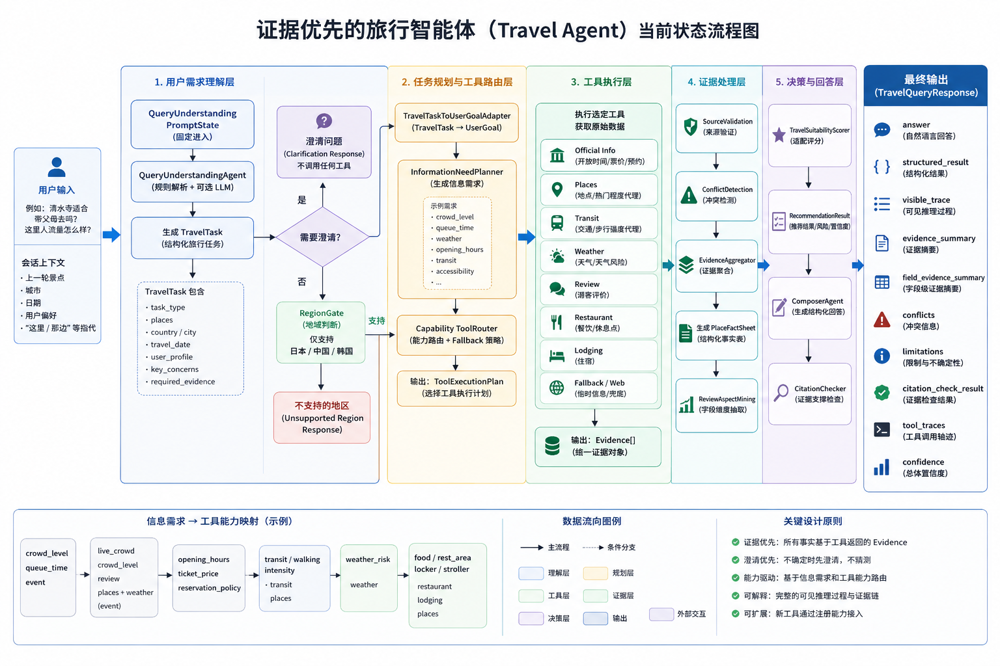

# Evidence-first Travel Intelligence Agent

> 当前主线先看 [REPO_MAP.md](REPO_MAP.md) 和 [docs/PROJECT_MAINLINE.md](docs/PROJECT_MAINLINE.md)。
> 运行入口在 `apps/agent-python/app/main.py`，核心状态链在 `apps/agent-python/app/orchestrator/state_machine.py`。

面向日本、中国、韩国的 **Evidence-first Travel Intelligence Agent**。

> **当前版本：Mock MVP + Real Data Pilot（小范围真实数据）**  
> 默认 `TOOL_MODE=hybrid`：优先真实 Weather / Places / 官方白名单页面；失败、超时或缺少 API key 时回退 mock。  
> 开放时间、票价、交通、评价等仍以 **mock tools** 为主；天气与地点在配置密钥后可走真实 API。  
> 所有事实经 **Evidence 链路**聚合后生成回答，**不来自 LLM 训练记忆**；未配置真实 API 时行为与 Mock MVP 一致。

**运维手册**：[RUNBOOK.md](RUNBOOK.md)（安装、API 示例、故障排查）

---

## 快速开始

> **重要**：默认从仓库根目录一条命令启动 Agent + MCP 搜索栈 + Web 界面。脚本会自动进入 `apps/agent-python/`、补齐 `.env`、设置 `PYTHONPATH`、检查/启动 MCP 与 Web，并拉起 uvicorn。  
> 本地默认链路：`apps/web` (:5173) → `apps/agent-python` (:8001)。完整 Gateway 链路可切换为 `apps/web` → `apps/api-java` (:8082) → `apps/agent-python`。

```powershell
# 首次安装依赖（只需一次）
cd apps/agent-python
pip install -r requirements.txt
copy .env.example .env          # Windows
cd ..\..

# 一条命令启动 Agent + MCP 搜索栈 + Web（Agent :8001，Web :5173）
.\scripts\start-agent.ps1

# 可选：仅启动 Agent，不启动 MCP
.\scripts\start-agent.ps1 -NoMcp

# 可选：不启动 Web
.\scripts\start-agent.ps1 -NoWeb

# 可选：只启动 Web（适合后端已在运行时补开页面）
.\scripts\start-agent.ps1 -WebOnly

# 可选：MCP 启动失败仍继续启动 Agent（检索证据会不完整）
.\scripts\start-agent.ps1 -AllowMcpFailure

# 可选：换端口
.\scripts\start-agent.ps1 -Port 8002
```

### 访问地址

| 地址 | 说明 |
|------|------|
| http://127.0.0.1:8001/agent/health | Agent 健康检查 |
| POST http://127.0.0.1:8001/agent/query | 旅行问答 API |
| http://127.0.0.1:5173/ | Web UI（由 `.\scripts\start-agent.ps1` 默认启动） |
| `apps/agent-python/debug_last_session.md` | 最近一次问答的调试日志（本地覆盖写入） |

详见 [apps/agent-python/README.md](apps/agent-python/README.md) 与 [apps/web/README.md](apps/web/README.md)。

### Agent Core Store（可选）

默认 Agent Core 状态存在单次运行内存 sidecar 中。需要本地审计日志时可开启：

```env
AGENT_CORE_STORE_BACKEND=jsonl
AGENT_CORE_STORE_JSONL_PATH=./data/agent_core_store.jsonl

# 或使用可查询 SQLite 事件表
AGENT_CORE_STORE_BACKEND=sqlite
AGENT_CORE_STORE_SQLITE_PATH=./data/agent_core_store.sqlite3
```

`debug_last_session.md` 会从 `orchestration_summary.agent_core_projection` 展示 phase、research plan、evidence projection、job status 和 gaps。

### LLM 配置（可选）

```env
LLM_MODE=anthropic
DEEPSEEK_API_KEY=sk-...
DEEPSEEK_MODEL=deepseek-v4-flash
ANTHROPIC_BASE_URL=https://api.deepseek.com/anthropic
```

离线演示可设 `LLM_MODE=mock`（不调用 LLM，evidence 链路仍完整）。

### API 示例

```bash
curl -X POST http://127.0.0.1:8001/agent/query ^
  -H "Content-Type: application/json" ^
  -d "{\"query\":\"京都清水寺适合带父母去吗？\",\"user_context\":{\"party\":[\"elderly\"]}}"
```

---

## Agent Core 回答链路（主流程）



```text
User Query
  → RootAgentSupervisor
  → input_contract（QueryUnderstanding + ResponseContract）
  → pipeline_gate / region_policy
  → research_plan（多 claim 检索计划）
  → evidence_acquisition（S5 工具与 subagent loop）
  → evidence_review（claim decision / gaps）
  → answer_draft
  → citation_guard
  → delivery
```

系统**不再**以旧 S0-S10 dispatch 作为主控链路。Root Agent 按 phase chain 推进；PipelineGate 过滤数据工具与 control tools；Store 是 phase/evidence/artifact/job 的事实源，`PipelineState` 是派生投影。Composer 仍只基于 Evidence / ClaimDecision 作答。

**精确实时事实**（开放时间、票价、今日天气、实时人流）必须 `evidence_required`，禁止 model prior。

### 用户需求理解层（LLM-first）

主路径：**LLMUnderstandingState → LLMUnderstandingSubAgent → NormalizedUserRequest JSON → S3 AnswerModeRouter**。

S2 子代理提示词（`app/prompts/llm_understanding.*.md`）按 **S3 路由契约** 设计：子代理必须一次输出 `query_scope`、`country`、`answer_policy` 等字段，**下游 adapter 仅做 1:1 映射**，不再推断 scope/country。

| 文件 | 职责 |
|------|------|
| `llm_understanding.routing_contract.md` | S3 决策表：问题类型 → 字段组合 |
| `llm_understanding.system.md` | Schema + 标定示例（喀纳斯湖/清水寺/指代澄清） |
| `llm_understanding.user.md` | 输入 + 输出前自检清单 |
| `llm_understanding.repair.md` | JSON 校验失败时的一次性修复提示 |

### Capability-based Tool Router

用户问的是**信息需求**（人流、适老、天气），不是工具名。链路先把自然语言转成 `TravelTask` + `InformationNeed`，再由 `ToolRouter` 按 **capabilities** 动态选工具：

| 用户问题 | 工具组合 |
|---------|---------|
| 这里人流量怎么样？ | `reviews` + `places` + `fallback` |
| 故宫今天人多吗？ | 同上 + `weather` + `reservation_policy` |
| 适合带爸妈吗？ | `reviews` + `transit` + `official` + `restaurant` |

**人流量**：当前无实时人流 API，使用评价 + 地图代理 + fallback，回答中标注估算性质。

---

## Real Data Pilot（真实数据试点）

首期接入 **Weather / Places / 官方白名单页面** 及 **MCP adapter 占位**。真实 API 响应必须先归一化为 `Evidence[]`；Composer / Scorer / CitationChecker **不得**直接读取原始 response。

### 工具模式 `TOOL_MODE`

| 值 | 行为 |
|----|------|
| `mock` | 仅 mock 工具（`ToolRegistry(use_mock=True)` 或显式设置） |
| `real` | 优先真实工具；失败仍回退 mock |
| `hybrid`（默认） | 先调 real；超时 / 失败 / 缺 key 时 fallback mock，并在 `Evidence.limitations` 与 `tool_trace` 标记 `fallback_used=true` |

```env
TOOL_MODE=hybrid
ENABLE_REAL_WEATHER=false
ENABLE_REAL_PLACES=false
ENABLE_REAL_OFFICIAL_PAGE=false
MCP_ENABLED=true
REAL_TOOL_TIMEOUT_SECONDS=8
REAL_TOOL_CACHE_TTL_SECONDS=3600
```

### 配置 Weather API

1. 在 [OpenWeatherMap](https://openweathermap.org/api) 申请 API key  
2. `apps/agent-python/.env`：

```env
ENABLE_REAL_WEATHER=true
WEATHER_API_KEY=your_openweather_key
```

### 配置 Places API

试点使用 OpenStreetMap Nominatim（`PLACES_API_KEY` 作为启用开关，不向第三方发送该 key）：

```env
ENABLE_REAL_PLACES=true
PLACES_API_KEY=pilot
```

### 配置官方页面白名单

在 `apps/agent-python/app/config.py` 的 `official_page_whitelist` 维护景点 → 官方 URL（仅政府 / 官方旅游站，不做全网爬虫）。内置示例：`Kiyomizu-dera`、`Fushimi Inari`、`Senso-ji`。

```env
ENABLE_REAL_OFFICIAL_PAGE=true
```

### 启用 MCP adapter

```env
MCP_ENABLED=true
```

占位：`weather_mcp`、`places_mcp`、`official_reader_mcp`（`app/tools/adapters/mcp_tool_adapter.py`）。MCP 返回须经 `Evidence` schema 校验。

### 试点 Golden Queries

`apps/agent-python/app/evals/real_data_pilot_queries.json` — 5 条京都 / 东京 query；mock 模式可跑；hybrid + API key 后 weather / places 可走真实数据。

### 数据合规

- **当前仍不建议**大规模评论抓取。  
- 评论平台、OTA 需单独处理 **ToS 与授权**；勿存储未经授权的评论全文。  
- 不绕过登录、验证码、反爬；不大规模爬取网页。

---

## 架构要点

- **Catalog 层**：`place_catalog` 隔离 mock 数据与回答层
- **字段级 evidence**：`field_evidence_summary`（每字段 value + source_ids + confidence）
- **CitationChecker**：claim / value 级引用校验
- **Hybrid 工具链**：`HybridTravelTool` + `app/storage/tool_cache.py`（TTL 缓存，`cache_hit` 记入 trace）
- **Tool 抽象**：`BaseTravelTool` → `Evidence[]` → `PlaceFactSheet` → Composer

## 功能范围

- 单景点情报卡、多景点比较、轻量行程
- Web UI + REST API
- `visible_trace` / `field_evidence_summary` / `tool_traces` / `limitations` / `citation_check_result`
- Golden + P0–P4 架构评测 + Real Data Pilot 集成测试

## 目录结构

```text
Evidence-first Travel Intelligence Agent/
├── README.md
├── RUNBOOK.md
├── REPO_MAP.md
├── apps/
│   ├── agent-python/          # Python Agent 核心（FastAPI :8001）
│   ├── api-java/              # API Gateway (:8082)
│   └── web/                   # 前端 SPA
├── packages/tools/            # 工具 / MCP / mock 数据真相源
├── contracts/                 # 跨语言 JSON Schema
└── image.png
```

## 如何新增景点 mock data

1. `packages/tools/mock/data.py` → `PLACE_REGISTRY` / `PLACE_ALIASES` / `CITY_COUNTRY` / `MOCK_REVIEWS`
2. `apps/agent-python/app/config.py` → `supported_cities`（如需要）
3. `apps/agent-python/app/evals/golden_queries.json` + 评测用例

Catalog 通过 `MockPlaceCatalogBackend` 自动读取，**无需**修改 Composer / Scorer。

## 运行评测

```bash
cd apps/agent-python
$env:PYTHONPATH = (Get-Location).Path   # PowerShell
python -m compileall app
pytest app/evals -q                              # mock 评测（须全部通过）
pytest app/evals -m real_api -q                  # 真实 API（无 key 自动 skip）
```

## 故障排查

| 现象 | 处理 |
|------|------|
| `ModuleNotFoundError: No module named 'app'` | 优先从仓库根目录运行 `.\scripts\start-agent.ps1`；脚本会自动设置 `PYTHONPATH` |
| 端口占用 | 换端口 `.\scripts\start-agent.ps1 -Port 8002` |
| open-webSearch 无法启动 | 看 `logs/mcp/open-websearch.out.log` / `logs/mcp/open-websearch.err.log`；常见原因是首次 npm 下载被网络/代理拦截 |
| Web 无法启动 | 看 `logs/web/vite.out.log` / `logs/web/vite.err.log`；只补开 Web 可运行 `.\scripts\start-agent.ps1 -WebOnly` |
| Web 提交后显示 Internal Server Error | 通常是 Vite 代理打到未启动的 `api-java :8082`；默认本地应走 direct agent，可重启 `.\scripts\start-agent.ps1 -WebOnly` |
| `GET /agent/query` 返回 405 | 正常现象；`/agent/query` 只接受 `POST`，健康检查请访问 `/agent/health` |
| 回答过于模板化 | 检查 `LLM_MODE=mock`；配置 `DEEPSEEK_API_KEY` 后设 `LLM_MODE=anthropic` |
| 真实天气未生效 | 确认 `ENABLE_REAL_WEATHER=true` 且 `WEATHER_API_KEY` 已设置；查看 `tool_traces` 是否 `fallback_used` |

更多见 [RUNBOOK.md §11 故障排查](RUNBOOK.md)。

## 当前限制

- 重点支持 **日本、中国、韩国**；景点库覆盖有限
- 数据以 **mock** 为主；真实试点仅 weather / places / 官方白名单
- **实时人流、排队、地图热力** 尚未接入；当前为评价 / 代理估算
- **CitationChecker** 为规则级检测，非完美事实验证
- 未接入 PostgreSQL / Redis / 生产级前端

## 设计原则

- Evidence-first / Source-aware / Conflict-aware / Persona-aware
- State-machine constrained
- 无法证实的内容通过 `limitations` 或降低 `confidence` 表达

## 上传 GitHub

```powershell
.\upload_to_github.ps1 -DryRun
.\upload_to_github.ps1
```

详见 [RUNBOOK.md](RUNBOOK.md)。
