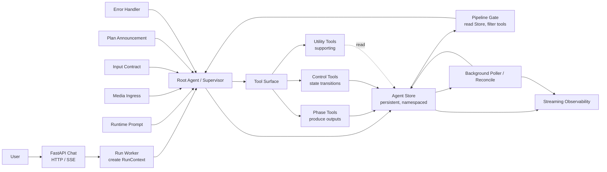

# Agent Core Redesign Plan

> 目标：把当前 S0-S10 顺序状态机重构为“Root Agent / Supervisor + Pipeline Gate + Tool Surface + Persistent Store”的 Agent Core。状态链只定义 phase 边界，Root Agent 在每个 phase 内执行 loop；工具只产出记录，Store 是事实源，PipelineState 是派生投影。

## 1. 为什么要重设

当前项目主线是：

```text
FastAPI -> TravelAgentStateMachine -> S0-S10 -> S5 controlled loop -> S7 gap loop -> S8 compose
```

这条链路能跑，但状态设计已经偏离目标：

- `TravelAgentState` 同时承载输入理解、临时 loop 变量、工具 trace、证据池、最终答案、debug 信息和多任务分支，变成“可变大对象”。
- 工具白名单、phase 进度、gap retry、effective query count、task class 策略散在多个 helper 中，Root Agent 对“现在为什么能/不能调用某工具”缺少统一视图。
- S5/S7/S8 名义上是状态，实际每个状态内部又有 agent loop、deterministic supplement、gap loop、subagent loop，边界不清。
- 工具输出直接合并进 `state.evidence`，缺少可审计的 `phase_outputs`、`artifact_records`、`job_records`。
- “人审/确认/回滚/重跑某 phase”的能力没有一等建模，导致调试时只能看 `debug_last_session.md`，不能基于 phase record 操作。

新的设计应保留 evidence-first 原则，但让状态链更像图片中的 Agent Core：Root Agent 负责 loop 和决策；Store 保存 source of truth；Pipeline Gate 只读 Store 并控制可见工具；Phase Tool 产出 phase output；Control Tool 改状态；Utility Tool 提供支持信息。

## 2. 目标架构



核心原则：

1. `PhaseState` 是 source of truth，记录 phase 状态、审批状态、输入快照、输出指针和错误。
2. `PipelineState` 不是手写状态，而是从 Store 派生的只读投影，供 Root Agent 决策。
3. Phase Tool 只负责产出 `PhaseOutput` / `ArtifactRecord` / `EvidenceRecord`，默认状态为 `pending_review` 或 `draft`。
4. Control Tool 才能改变 phase 状态，例如 `approve_phase`、`rollback_to_phase`、`reconcile_job`。
5. Pipeline Gate 每轮读取 Store，根据当前 phase、合同、预算、工具健康、证据缺口过滤 Tool Surface。
6. Root Agent 不直接“写最终答案字符串”，而是推进 phase，最后由 `compose_answer` 产出 answer artifact。

## 3. 新状态链

旧 S0-S10 不是全部废弃，而是折叠成更少、更清晰的 phase。

| 新 Phase | 替代旧阶段 | 目标产物 | 是否可人审 |
| --- | --- | --- | --- |
| `ingress` | S0/S1 | `RunContext`, `UserInputRecord` | 否 |
| `input_contract` | S2/S3/S4 | `InputContract`, `ResponseContract`, `RegionPolicyDecision` | 异常时可审 |
| `research_plan` | S5 前半 | `ResearchPlan`, `ClaimPlan[]`, `ToolBudget` | 可审 |
| `evidence_acquisition` | S5/S6 | `EvidenceRecord[]`, `ToolTraceRecord[]`, `JobRecord[]` | 可审 |
| `evidence_review` | S7/gap loop | `EvidenceBrief`, `ClaimDecision[]`, `GapRequest[]` | 可审 |
| `answer_draft` | S8 | `AnswerArtifact(status=draft)` | 可审 |
| `citation_guard` | S9 | `CitationCheck`, `LimitationRecord[]` | 可审 |
| `delivery` | S10 | `FinalAnswerArtifact(status=succeeded)` | 否 |

推荐状态枚举：

```text
not_started
running
blocked
failed
pending_review
approved
succeeded
rolled_back
skipped
```

关键变化：

- `research_plan` 不直接调用工具，只产出“应该查什么、用哪些 source family、查询退避规则”。
- `evidence_acquisition` 可以多轮 loop，但每次工具调用都写 `ToolTraceRecord`，每条证据都写 `EvidenceRecord`。
- `evidence_review` 决定证据是否足够；不足时创建 `GapRequest`，而不是把 gap loop 藏在 state machine 方法里。
- `answer_draft` 产物先是 draft，可被 `approve_phase` 批准，也可 rollback 到 `research_plan` 或 `evidence_acquisition`。

## 4. Agent Loop 指导关系

Root Agent 每轮只做五件事：

```text
1. read PipelineState projection
2. ask Pipeline Gate for visible tools
3. choose one action: call phase tool / call control tool / wait job / finish / fail
4. reducer writes records to Store
5. stream observation event
```

伪代码：

```python
while not pipeline.done:
    pipeline = store.project_pipeline(run_id)
    visible_tools = pipeline_gate.visible_tools(pipeline)
    action = root_agent.next_action(pipeline, visible_tools)
    result = tool_surface.invoke(action)
    store.append_records(run_id, result.records)
    observer.publish(result.events)
```

Root Agent 的系统提示不再塞入所有历史细节，而是提供：

- 当前 phase。
- phase objective。
- unresolved gaps。
- allowed tools。
- phase outputs summary。
- budgets and stop rules。
- last errors。

这能避免当前 S5 prompt context 越来越厚，且“谁能调用什么工具”难以解释。

## 5. Store 设计

建议先用本地 SQLite / JSONL 实现，接口按 Store 抽象写，后续可换 LangGraph Store。

命名空间：

```text
runs/{run_id}/phase_state
runs/{run_id}/phase_outputs
runs/{run_id}/evidence_records
runs/{run_id}/artifact_records
runs/{run_id}/tool_traces
runs/{run_id}/jobs
runs/{run_id}/memory_refs
sessions/{session_id}/memory
```

核心 schema：

```python
class PhaseState:
    run_id: str
    phase: str
    status: str
    attempt: int
    input_refs: list[str]
    output_refs: list[str]
    approved_by: str | None
    approved_at: str | None
    error: str | None

class PhaseOutput:
    id: str
    run_id: str
    phase: str
    kind: str
    status: str  # draft | pending_review | approved | rejected | succeeded
    payload: dict
    evidence_refs: list[str]
    created_by: str

class EvidenceRecord:
    id: str
    run_id: str
    claim_id: str | None
    source_type: str
    source_name: str
    source_url: str | None
    payload: dict
    strength: str
    usage_role: str  # answerable | context | rejected | conflict

class ArtifactRecord:
    id: str
    run_id: str
    artifact_type: str  # answer | plan | table | debug_report
    status: str
    payload: dict
    cited_evidence_refs: list[str]

class JobRecord:
    id: str
    run_id: str
    tool_name: str
    status: str  # queued | running | succeeded | failed
    input: dict
    output_ref: str | None
```

`TravelAgentState` 在新设计中应降级为 `PipelineState` 投影，不再作为主写入对象：

```python
class PipelineState:
    run_id: str
    current_phase: str
    phase_status: dict[str, str]
    input_contract: dict | None
    research_plan: dict | None
    evidence_summary: dict
    claim_decisions: list[dict]
    gaps: list[dict]
    visible_tool_names: list[str]
    budgets: dict
    latest_artifacts: dict
```

## 6. Tool Surface 分层

### Phase Tools

产出业务记录，不直接改 phase 状态。

| Tool | 替代现有模块 | 输出 |
| --- | --- | --- |
| `build_input_contract` | `LLMUnderstandingState`, `AnswerModeRouter`, `ResponseContractCompiler` | `InputContract`, `ResponseContract` |
| `build_research_plan` | `ClaimSearchPlanner`, `S5DiversifiedToolSelector`, task catalogs | `ResearchPlan` |
| `run_evidence_query` | `keyword_search_agent`, `fact_lookup_agent`, MCP adapters | `EvidenceRecord[]`, `ToolTraceRecord` |
| `curate_evidence` | `EvidenceAggregationState`, `claim_relevance_filter_agent` | `EvidenceBrief`, `ClaimDecision[]` |
| `generate_gap_requests` | `evidence_gap_planner`, `claim_gap_fill_planner` | `GapRequest[]` |
| `compose_answer_draft` | `AnswerCompositionState`, `AnswerComposerAgent` | `AnswerArtifact(draft)` |
| `run_citation_guard` | `CitationChecker`, sanitizer | `CitationCheck`, `LimitationRecord[]` |

### Control Tools

只改 Store 中 phase/job 状态。

| Tool | 作用 |
| --- | --- |
| `approve_phase(phase, output_id)` | 把 phase output 从 `pending_review` 标为 `approved`，phase 可进入下一阶段 |
| `rollback_to_phase(phase, reason)` | 将后续 phase 标为 `rolled_back`，恢复指定 phase 为 `running` |
| `skip_phase(phase, reason)` | 明确跳过非必需 phase |
| `reconcile_job(job_id)` | 查询异步任务状态并写回 JobRecord |
| `mark_phase_failed(phase, error)` | 统一错误状态 |

### Utility Tools

不改变 phase，提供上下文。

| Tool | 作用 |
| --- | --- |
| `retrieve_memory` | 读取长期偏好、历史目的地、用户约束 |
| `check_tool_health` | MCP/HTTP/CLI 可用性 |
| `check_budget` | token、工具调用、时间、额度 |
| `summarize_store` | 压缩 Store 记录给 Root Agent |

## 7. Pipeline Gate

Pipeline Gate 是工具可见性的唯一入口，替代散落的 whitelist / task catalog / hard-coded guards。

输入：

- `PipelineState`
- `InputContract`
- `ResponseContract`
- phase state
- tool health
- budget
- human review policy

输出：

```python
class ToolVisibility:
    allowed_tools: list[ToolSpec]
    blocked_tools: list[BlockedTool]
    required_next_actions: list[str]
    stop_reasons: list[str]
```

规则示例：

- `input_contract` 未完成时，只开放 `build_input_contract`、`retrieve_memory`、`fail_state`。
- `research_plan` 未 approved 时，不开放 `run_evidence_query`。
- `evidence_acquisition` 有 running job 时，只开放 `reconcile_job`、`check_budget`、`rollback_to_phase`。
- `evidence_review` 若 `ClaimDecision.can_answer=false`，开放 `generate_gap_requests`，不开放 `compose_answer_draft`。
- `answer_draft` 产出后默认 `pending_review`，若配置 `auto_approve_low_risk=true` 可自动调用 `approve_phase`。

## 8. Human-in-the-loop

现有项目可以先做“软人审”，即自动 approve，但 Store schema 按人审保留字段。

建议策略：

| Phase | 默认策略 |
| --- | --- |
| `input_contract` | 自动通过；低置信度进入 `pending_review` |
| `research_plan` | 自动通过；工具预算过高进入 `pending_review` |
| `evidence_review` | 硬事实冲突或无官方来源进入 `pending_review` |
| `answer_draft` | 默认 `pending_review`；CLI/API 可以配置 auto approve |
| `delivery` | 只发送 approved artifact |

这样以后要做 Web 端审核、回滚、重试，不需要推翻核心架构。

## 9. 迁移路线

### Phase 0：文档和接口冻结

- 新增 Store schema 和 tool surface 接口。
- 保留 `TravelAgentStateMachine.run()` 作为外部 API，不改 FastAPI contract。
- `debug_last_session.md` 改为从 Store projection 生成，而不是读取可变 state。

### Phase 1：Store 旁路写入

保留当前状态机执行，但每个关键阶段旁路写 Store：

- S2/S3/S4 写 `input_contract` phase output。
- S5 写 `research_plan`、`evidence_records`、`tool_traces`。
- S7 写 `evidence_review` output。
- S8 写 `answer_draft` artifact。

此阶段不改行为，只建立可观测 source of truth。

### Phase 2：PipelineState 投影

- 新增 `store.project_pipeline(run_id)`。
- Root Agent / S5 prompt context 不再直接读全量 `TravelAgentState`，改读 projection。
- `ToolWhitelistBuilder` 逐步迁移到 `PipelineGate`。

### Phase 3：Root Supervisor 替代 S0-S10 主调度

- 引入 `RootAgentSupervisor.run(run_id)`。
- 每个 phase 由 tool surface 执行。
- `TravelAgentStateMachine` 变成兼容包装器：创建 run、调用 supervisor、返回 final artifact。

### Phase 4：Control Tool 和人审

- 实现 `approve_phase`、`rollback_to_phase`、`reconcile_job`。
- Web/SSE 展示 phase progress、tool IO、draft artifact。
- 支持对某个 phase 重跑，而不是整条链重跑。

### Phase 5：删除旧状态字段

当 Store 投影稳定后，逐步移除 `TravelAgentState` 中的临时字段：

- `structured_result` 中的 phase 临时键。
- `evidence_planning_completed` / `evidence_accumulated` 等布尔状态。
- `gap_loop_state` 和 `current_evidence_gap_request`。
- tool attempt ledger 的分散缓存。

## 10. 与当前代码映射

| 当前模块 | 新职责 |
| --- | --- |
| `state_machine.py` | 先作为兼容入口，最终变成 `RunWorker + RootSupervisor` 包装 |
| `TravelAgentState` | 降级为 `PipelineState` 兼容投影 |
| `EvidencePlanningAndToolUseState` | 拆成 `build_research_plan` 和 `run_evidence_query` phase tools |
| `ActionModelController` | 缩小为 Root Agent 的 action planner |
| `StateReducer` | 改成 Store record reducer |
| `ToolWhitelistBuilder` | 合并进 `PipelineGate` |
| `S5DiversifiedToolSelector` | 变成 `ResearchPlanBuilder` 的策略插件 |
| `EvidenceAggregationState` | 变成 `curate_evidence` / `generate_gap_requests` tools |
| `AnswerCompositionState` | 变成 `compose_answer_draft` tool |
| `CitationChecker` | 变成 `run_citation_guard` tool |
| `debug_session_log.py` | 从 Store projection 生成 debug report |

## 11. 对旅游 Agent 的任务类设计

任务类不应再直接改变状态链，而应影响 `ResearchPlan` 和 `PipelineGate`。

建议把任务类分为三层：

```text
Intent family: lookup / advisory / planning / comparison / review_check
Task class: ticket_price_lookup / opening_hours_lookup / route_first / nearby_guided / ...
Claim plan: one or more claim objectives with source families and evidence ladder
```

例如“夫子庙需要收费吗”：

```text
input_contract:
  intent_family = lookup
  task_class = ticket_price_lookup
  claim_objectives:
    - area_charge_policy
    - internal_ticket_price_candidates

research_plan:
  phase queries:
    - official/free-open policy
    - platform ticket candidate
    - map/entity anchor

evidence_review:
  decisions:
    - open_area_fee_policy: candidate/partial/strong
    - internal_ticket_price: partial platform candidate

answer_draft:
  sections:
    - 开放区域是否收费
    - 内部景点/项目票价
    - 优惠/免票政策证据缺口
```

这样不会再把“平台抓到 29 元”直接升级为“夫子庙整体门票 29 元”。

## 12. 验收标准

新的设计落地后，应满足：

- 任一回答都能追溯到 phase output、evidence record 和 artifact record。
- Root Agent 每一步为什么能调用某工具，可由 Pipeline Gate 解释。
- 同一个 run 可 rollback 到任意 phase 并重跑。
- async crawler / MCP job 可通过 JobRecord reconcile，不阻塞整个状态机。
- `debug_last_session.md` 能展示 phase 状态、有效查询次数、证据采用/拒绝原因、最终 artifact。
- Composer 只能读取 approved / answerable evidence projection，不能读取 raw unreviewed evidence 直接写硬事实。

## 13. 推荐优先实现的最小闭环

先实现一个不破坏现有 API 的最小版本：

1. `AgentStore`：内存 + JSONL 双实现。
2. `PhaseState`、`PhaseOutput`、`EvidenceRecord`、`ArtifactRecord` schema。
3. 在当前 S2/S5/S7/S8/S9 旁路写 Store。
4. `PipelineState.project()` 从 Store 生成 debug projection。
5. `PipelineGate.visible_tools()` 先包住现有 `ToolWhitelistBuilder`。
6. 新增 `docs/debug_session_v2.md` 或替换 `debug_last_session.md` 的生成来源。

这个闭环完成后，再重构 Root Supervisor。这样风险最低，也不会打断当前 lookup / non-lookup 任务类的调试。

## 14. 当前实验落地状态

已完成第一版直接切换：

- `TravelAgentStateMachine.run()` 已改为由 `RootAgentSupervisor` 接管。
- `RootAgentSupervisor` 已改为显式 Agent Core phase chain：`input_contract -> pipeline_gate/region_policy -> research_plan -> evidence_acquisition/review -> answer_draft -> citation_guard -> delivery`。
- 旧 `_dispatch_from_contract` / `_dispatch_by_answer_mode` 不再参与主入口，只保留为历史兼容 helper；测试已锁定 Root Supervisor 不调用旧 dispatch。
- `PipelineGate` 已作为工具可见性的统一入口接入；S5 `EvidencePlanningAndToolUseState` 已改为消费 Gate 输出的 `ToolVisibility/ToolWhitelist`，目前 Gate 内部仍包裹现有 `ToolWhitelistBuilder`。
- `PipelineGate` 已从直接包装 builder 改为汇聚 `DataToolVisibilityPolicy`、Store projection、phase 状态与 control tools；旧 `ToolWhitelistBuilder` 保留为数据工具策略引擎，后续可继续拆细。
- `research_plan` 已升级为真实 `ResearchPlan` artifact：Root Supervisor 在 evidence phase 前生成多 claim 检索计划，Store 同时记录 phase output 和 artifact，S5 prompt context 会读取该计划。
- `approve_phase` / `rollback_to_phase` / `reconcile_job` 已作为 `AgentCoreControlTools` 落地；PipelineGate 会把它们放在独立的 `control_tools` 字段中，不混入 S5 的数据抓取 `allowed_tools`。
- `answer_draft` 和 `citation_guard` 已切到 control tool 批准路径；除 `ingress` 初始化外，业务 phase 不再由 `state_machine` 直接 `set_phase` 批准。
- `debug_last_session.md` 已新增 `Agent Core Projection` 视图，会从 `orchestration_summary.agent_core_projection` 展示 phase 状态、research plan、evidence projection、job status 和 gaps。
- `AgentCoreStore` 已抽象成协议接口；当前 `InMemoryAgentStore` 仍作为 sidecar 实现，调用方不再依赖内部 `phase_outputs` 列表。
- 已新增 `JsonlAgentStore` / `SQLiteAgentStore`，可通过 `AGENT_CORE_STORE_BACKEND=jsonl|sqlite` 将 Agent Core 写入本地 audit log / queryable event table。
- `EvidenceRecord` projection 已对齐 evidence decision：展示 usage role、strength、adopted/rejected evidence 统计和有效查询次数。
- 已新增 `AgentCoreJobReconciler` 和 `AgentCoreJobResolverRegistry`，用于按 tool_name 轮询 pending/running `JobRecord` 并通过 `reconcile_job` control tool 写回状态。
- `InMemoryAgentStore` 会记录 phase output、evidence record、answer artifact，并在 `orchestration_summary.agent_core_projection` 暴露投影。
- 当前 API schema 未变；这是为了先验证架构能 work，再逐步替换内部 phase tool。

下一步建议：

1. 继续把 `ToolWhitelistBuilder` 中的具体 claim/domain 规则拆入更小的 Gate policy 模块。
2. 将 SQLite event table 增加 replay/恢复 PipelineState 的启动流程。
3. 将真实 async MCP/crawler provider 接入 `AgentCoreJobResolverRegistry`。
