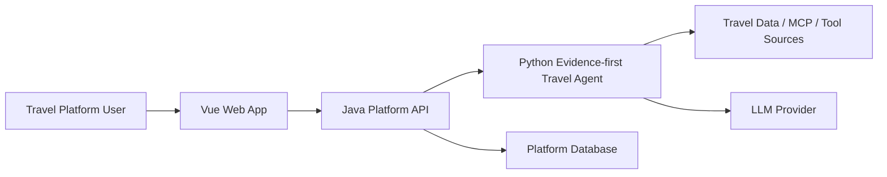
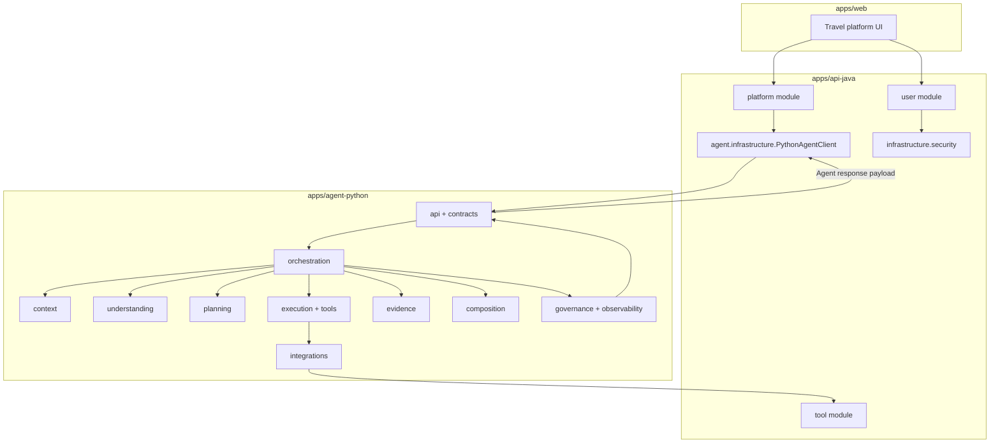

# Java + Agent Layering Standardization Implementation Plan

## Execution Prompt For Codex Resume

When continuing this plan after context compression or a new user request, follow these rules exactly:

1. Before executing any task, read this plan file first and identify the next unchecked task or the task explicitly requested by the user.
2. Execute exactly one task at a time unless the user explicitly asks for more.
3. After executing a task, stop. Do not continue to the next task.
4. Every executed task must update this plan before responding:
   - change its completion checkbox from `[ ]` to `[x]`;
   - add a short `Execution result` note immediately after the checkbox;
   - include commands run, pass/fail result, files changed, and any blocker or plan correction.
5. Every final response after a task must summarize the same result that was written into this plan.
6. If a task reveals the plan is wrong, fix the plan first, record the correction in that task's `Execution result`, then stop and report it.
7. If a task reveals a difficult issue that should not be solved inside the current task, write it into the most relevant later task as a follow-up note before marking the current task complete.
8. Do not commit unless the user explicitly asks. Do not revert unrelated user changes.
9. Treat `rg` checks that expect no matches as successful when there is no output, even if `rg` exits with code 1.

Current completed tasks:
- `[x]` Task 1: Freeze baseline and inventory.
- `[x]` Task 2: Normalize root-level classes.
- `[x]` Task 3: Enforce domain boundaries.
- `[x]` Task 4: Standardize user module.
- `[x]` Task 5: Standardize platform module.
- `[x]` Task 6: Standardize agent module.
- `[x]` Task 7: Standardize tool gateway module.
- `[x]` Task 8: Standardize cross-cutting concerns.
- `[x]` Task 9: Prepare documentation standards.
- `[x]` Task 10: Java full verification and cleanup.
- `[x]` Task 11: Agent API contract layer.
- `[x]` Task 12: Agent context layer.
- `[x]` Task 13: Agent understanding and planning layers.
- `[x]` Task 14: Agent execution, tools, and integrations layers.
- `[x]` Task 15: Agent evidence layer.
- `[x]` Task 16: Agent composition layer.
- `[x]` Task 17: Agent orchestration layer and capability facades.
- `[x]` Task 18: Agent governance and observability layers.
- `[x]` Task 19: Java-Agent product boundary and contract tests.
- `[x]` Task 20: Final cross-stack verification.

> Temporary execution plan for Codex. Follow this file task by task and update checkboxes as work is completed.

**Goal:** Standardize both the Java backend and the Python Travel Agent into one coordinated commercial-software-style layered platform for the Travel Agent user management and interaction system.

**Architecture:** Organize Java by business domain first, then by layer inside each domain. Organize Python Agent as commercial Agent product capability layers: API contract, session/context, understanding, planning, execution/tool access, evidence asset, composition, orchestration, governance, and observability. Java owns users, auth, conversations, records, favorites, profiles, subscriptions, and business platform state. Python owns one AgentRun at a time: understand, plan, retrieve evidence, evaluate evidence, compose an answer, and report trace/quality data back to Java.

**Tech Stack:** Java 17, Spring Boot, Spring MVC, Spring Security, Spring Data JPA, H2, JUnit 5, Maven, Python 3, FastAPI, Pydantic, pytest, Vue/Vite frontend as consumer.

---

## Current Context

- Repository root: `E:\学习文件\研究生\就业\Agent学习\Evidence-first Travel Intelligence Agent`
- Java app root: `apps/api-java`
- Current state already contains an in-progress layered split under:
  - `com.travel.intelligence.api.user`
  - `com.travel.intelligence.api.platform`
  - `com.travel.intelligence.api.agent`
  - `com.travel.intelligence.api.tool`
  - `com.travel.intelligence.api.common`
  - `com.travel.intelligence.api.infrastructure.security`
- Git currently reports old paths as deleted and new paths as untracked because files were moved during refactor. Final execution must verify these are intentional moves before staging.
- Python Agent currently keeps most reasoning code under `apps/agent-python/app/orchestrator`, `apps/agent-python/app/agents`, `apps/agent-python/app/tools`, `apps/agent-python/app/schemas`, and exposes FastAPI through `apps/agent-python/app/main.py`.
- Python Agent must be layered without breaking the compatibility startup command `uvicorn app.main:app --host 127.0.0.1 --port 8001 --reload`.
- Java-to-Agent HTTP contract is currently represented by Java `PythonAgentClient` and Python `AgentQueryRequest` / `AgentQueryResponse`; this contract must be treated as a stable integration boundary.

## System Architecture View

### C4 Level 1: Context



### C4 Level 2: Containers



## Target Package Rules

- `common`: shared API errors, exception mapping, small framework-independent helpers.
- `infrastructure.security`: JWT, Spring Security configuration, authentication filter, current-user adapter.
- `user.domain`: user aggregate, roles, principal model.
- `user.application`: auth/register/login/current-user use cases.
- `user.infrastructure`: user persistence repositories and data adapters.
- `user.web`: auth endpoints.
- `user.web.dto`: auth request/response DTOs.
- `platform.domain`: conversations, query records, platform workflow state.
- `platform.application`: conversation, history, favorite, and ask-agent use cases.
- `platform.infrastructure`: platform repositories and adapters.
- `platform.web`: platform REST endpoints.
- `platform.web.dto`: platform request/response DTOs.
- `agent.domain`: direct Travel Agent session memory contracts and state.
- `agent.application`: direct Python-agent query orchestration.
- `agent.infrastructure`: Python HTTP client and memory-store implementation.
- `agent.config`: agent client properties/configuration.
- `agent.web`: direct proxy/session endpoints retained for compatibility.
- `tool.application`: MCP/tool gateway orchestration.
- `tool.infrastructure`: search/MCP adapters.
- `tool.infrastructure.mcp`: MCP client implementation details.
- `tool.config`: tool gateway configuration.
- `tool.web`: tool gateway REST endpoint.
- `tool.dto`: external tool contract DTOs. Keep here unless later split into `tool.web.dto` and `tool.application.dto`.

## Target Python Agent Product Capability Layers

Python package root stays `apps/agent-python/app`.

- `api`: FastAPI routes, health endpoint, lifecycle/bootstrap glue, HTTP error translation. It receives Java Gateway requests and delegates immediately; it must not do business reasoning.
- `contracts`: stable request/response/error models for Java-Python communication and Agent output. Compatibility imports from `app.contract` must remain until Java and tests are updated.
- `context`: session and user context normalization for one AgentRun: Java `user_context`, conversation memory, travel preference profile, and context snapshot. This layer prepares context but does not answer.
- `understanding`: query understanding, language normalization, intent/task classification, entity/time/budget extraction, `TravelTask`, and `SemanticFrame` generation. It answers: "what is the user asking?"
- `planning`: research plan, information needs, evidence domains, tool selection, gap-filling, max rounds, and cost/budget-aware retrieval planning. It answers: "what must be checked to answer reliably?"
- `execution`: tool scheduling and runtime behavior: tool executor, registry abstraction, retry policy, timeout policy, fallback, tool trace. It does not judge final answer quality.
- `tools`: Agent-owned tool abstractions and in-process tool implementations. It should not know Java user/conversation data.
- `integrations`: external adapters: Java Tool Gateway, MCP, weather, places, search, official pages, LLM providers, and other third-party systems.
- `evidence`: evidence model, source quality, citation policy, normalization, aggregation, conflict detection, coverage checking, freshness checks, hallucination guard, evidence brief building.
- `composition`: answer generation from evidence and decisions only: answer composer, response contract compiler, prompt templates, sanitizer, limitations, confidence, citations, structured fields. It must not call tools directly.
- `orchestration`: state machine / workflow controller. It controls phase flow and failure recovery but should call capability services such as `understand()`, `plan()`, `execute_tools()`, `evaluate_evidence()`, `compose_answer()`, and `finalize()` instead of embedding detailed rules.
- `governance`: commercial Agent controls: cost policy, tool budget, timeout limits, safety policy, quality gates, failure reason taxonomy, SLA/quality rules.
- `observability`: logging, trace, debug session output, metrics, run timeline, quality reports. This layer reports what happened; it should not decide business behavior.
- `config.py`: may remain at package root as process-level settings during this refactor. Do not move it until API/bootstrap and integrations no longer import settings directly in many places.
- Compatibility packages (`orchestrator`, `agents`, `tools`, `tool_gateway`, `storage`, `catalog`, `schemas`) may remain temporarily, but each migration step must either move code into the target layer or create a compatibility wrapper with tests.

## Cross-Service Contract Rules

- Java calls Python only through the Agent HTTP contract.
- Python does not persist or own commercial user data. It processes one AgentRun and returns intelligence results.
- Python does not call Java platform user/conversation/favorite/profile APIs. Python may call Java Tool Gateway only through `integrations/java_gateway`.
- Java persists business assets:
  - `User`
  - `Conversation`
  - `QueryRecord`
  - `Favorite`
  - `Profile`
  - future `Subscription` / billing entities
- Python returns Agent intelligence output:
  - `answer`
  - `session_id`
  - `query_id`
  - `confidence`
  - `evidence_summary`
  - `tool_traces`
  - `visible_trace`
  - `limitations`
  - `semantic_frame_summary`
  - `structured_result`
- The Agent query API remains:

```http
POST /agent/query
GET /agent/health
```

- Request contract remains aligned between:
  - Java: `apps/api-java/src/main/java/com/travel/intelligence/api/agent/infrastructure/PythonAgentClient.java`
  - Python: `apps/agent-python/app/contracts/request.py` and `apps/agent-python/app/contracts/response.py` after migration, with `apps/agent-python/app/contract.py` kept as compatibility import.
- Python API routes delegate to an orchestration-facing `AgentRunService` / facade. Routes must not instantiate or manipulate individual state-machine phases directly.
- Java receives only the Agent response payload. Java must not import or depend on Python internal layer names such as `planning`, `evidence`, or `composition`.
- Agent response fields used by Java platform storage must remain stable:
  - `answer`
  - `session_id`
  - `query_id`
  - `visible_trace`
  - `evidence_summary`
  - `limitations`
  - `confidence`
  - `tool_traces`
  - `structured_result`

## Definition Of Done

- No source file declares an old package such as `com.travel.intelligence.api.session`, `com.travel.intelligence.api.client`, `com.travel.intelligence.api.config`, or `com.travel.intelligence.api.web`.
- `web` packages do not contain domain rules or persistence logic.
- `application` packages do not depend on Spring MVC controller classes.
- `domain` packages do not depend on Spring MVC, Spring Security, JPA repositories, HTTP clients, or infrastructure adapters.
- All Java tests pass with `mvn test`.
- Frontend still builds with `npm run build` because it consumes Java API contracts.
- Python Agent tests pass with `pytest`.
- `uvicorn app.main:app` remains a valid startup path after Python refactor.
- Python API layer delegates to orchestration instead of calling detailed state-machine internals directly.
- Python API layer owns HTTP status mapping. Capability layers should raise domain/application errors, not FastAPI `HTTPException`.
- Python orchestration layer calls capability services rather than embedding detailed understanding/planning/evidence/composition rules.
- Python composition layer does not call tools or integrations directly.
- Python understanding layer does not compose final answers.
- Python execution/tools layers do not write final responses.
- Python integrations own Java Tool Gateway, MCP, web/search/weather/places, LLM provider, and other external adapters.
- Python governance/observability own cost/tool budget, quality gates, trace, metrics, logging, and debug session output.
- README, RUNBOOK, and AGENTS describe the final Java layering accurately.
- README, RUNBOOK, and AGENTS describe the Python Agent layering and Java-Agent boundary accurately.
- Git status shows intentional moves/additions only, with no generated runtime files such as `target`, `data`, or `dist`.

---

## Task 1: Freeze Baseline And Inventory

**Files:**
- Inspect: `apps/api-java/src/main/java`
- Inspect: `apps/api-java/src/test/java`
- Inspect: `apps/api-java/pom.xml`
- Inspect: `README.md`
- Inspect: `RUNBOOK.md`
- Inspect: `AGENTS.md`

**Step 1: Capture current Java files**

Run from repository root:

```powershell
rg --files apps/api-java/src/main/java apps/api-java/src/test/java
```

Expected:
- Files are grouped under `agent`, `common`, `infrastructure`, `platform`, `tool`, and `user`.
- Old top-level packages appear only as Git delete records, not as active files.

**Step 2: Search for old package declarations**

Run:

```powershell
rg -n "package com\.travel\.intelligence\.api\.(client|config|session|web|tool\.mcp|tool);" apps/api-java/src/main/java apps/api-java/src/test/java
```

Expected:
- No matches.

**Step 3: Search for old imports**

Run:

```powershell
rg -n "import com\.travel\.intelligence\.api\.(client|config|session|web)\.|import com\.travel\.intelligence\.api\.tool\.mcp\." apps/api-java/src/main/java apps/api-java/src/test/java
```

Expected:
- No matches.

**Completion checkbox:** `[x] Task 1 complete`

**Execution result:** Completed baseline inventory. `rg --files apps/api-java/src/main/java apps/api-java/src/test/java` showed active Java code grouped under the target layered packages. Old package declaration search returned no matches. The original old-import regex was too broad and incorrectly matched valid `tool.application`, `tool.dto`, and `tool.infrastructure` imports, so the plan was corrected to search only old `client`, `config`, `session`, `web`, and `tool.mcp` imports. The corrected old-import search returned no matches. Files changed: this plan file only.

---

## Task 2: Normalize Root-Level Classes

**Files:**
- Inspect/modify: `apps/api-java/src/main/java/com/travel/intelligence/api/ApiJavaApplication.java`
- Inspect/modify: `apps/api-java/src/main/java/com/travel/intelligence/api/HealthController.java`
- Test: `apps/api-java/src/test/java/com/travel/intelligence/api/ApiJavaApplicationTests.java`

**Step 1: Decide root package policy**

Keep only the Spring Boot launcher in the root package:

```text
com.travel.intelligence.api.ApiJavaApplication
```

Move `HealthController` if it is a REST endpoint:

```text
from: com.travel.intelligence.api.HealthController
to:   com.travel.intelligence.api.common.HealthController
```

If health is considered operational infrastructure instead, move it to:

```text
com.travel.intelligence.api.infrastructure.web.HealthController
```

Preferred for this project: `common.HealthController`, because it is a shared API endpoint and currently small.

**Step 2: Update package declaration and imports**

Expected after move:

```java
package com.travel.intelligence.api.common;
```

**Step 3: Run focused test**

Run:

```powershell
cd apps/api-java
mvn test -Dtest=ApiJavaApplicationTests
```

Expected:
- Test passes.
- Spring context still discovers the health controller because it remains under `com.travel.intelligence.api`.

**Completion checkbox:** `[x] Task 2 complete`

**Execution result:** Moved `HealthController` from root package `com.travel.intelligence.api` to `com.travel.intelligence.api.common`, leaving `ApiJavaApplication` as the root Spring Boot launcher. Updated `TravelProxyControllerTest` to import `com.travel.intelligence.api.common.HealthController`. `mvn` was not available on PATH, so the equivalent command was run with the local Maven binary: `& 'E:\学习文件\研究生\就业\Java学习\Java相关\apache-maven-3.9.15\bin\mvn.cmd' test -Dtest=ApiJavaApplicationTests`. Result: `Tests run: 1, Failures: 0, Errors: 0, Skipped: 0`, `BUILD SUCCESS`. Files changed: `apps/api-java/src/main/java/com/travel/intelligence/api/common/HealthController.java`, `apps/api-java/src/test/java/com/travel/intelligence/api/agent/web/TravelProxyControllerTest.java`, and this plan file.

---

## Task 3: Enforce Domain Boundaries

**Files:**
- Inspect/modify: `apps/api-java/src/main/java/com/travel/intelligence/api/user/domain/*.java`
- Inspect/modify: `apps/api-java/src/main/java/com/travel/intelligence/api/platform/domain/*.java`
- Inspect/modify: `apps/api-java/src/main/java/com/travel/intelligence/api/agent/domain/*.java`
- Test: `apps/api-java/src/test/java/com/travel/intelligence/api/platform/TravelPlatformFlowTest.java`
- Optional new test: `apps/api-java/src/test/java/com/travel/intelligence/api/ArchitectureLayeringTest.java`

**Step 1: Check domain imports**

Run:

```powershell
rg -n "import org\.springframework\.(web|security)|import org\.springframework\.data|RestClient|WebClient|Repository|Controller" apps/api-java/src/main/java/com/travel/intelligence/api/user/domain apps/api-java/src/main/java/com/travel/intelligence/api/platform/domain apps/api-java/src/main/java/com/travel/intelligence/api/agent/domain
```

Expected:
- No matches except acceptable JPA annotations on persistent entities if the project keeps entities and persistence models unified for now.

**Step 2: Document pragmatic JPA exception**

If domain entities still use JPA annotations, keep them for this stage and document this as a deliberate pragmatic choice in `README.md`:

```markdown
Domain entities currently double as JPA entities to keep the project compact. If persistence complexity grows, introduce dedicated persistence models under `infrastructure`.
```

**Step 3: Add architecture safety test if practical**

Create:

```text
apps/api-java/src/test/java/com/travel/intelligence/api/ArchitectureLayeringTest.java
```

Minimum test intent:
- Assert no active Java source file contains old package declarations.
- Assert `domain` files do not import MVC controllers, security filter classes, HTTP clients, or repositories.

Use simple source scanning first to avoid adding new dependencies.

**Step 4: Run architecture test**

Run:

```powershell
cd apps/api-java
mvn test -Dtest=ArchitectureLayeringTest
```

Expected:
- Test passes.
- Failure message names the offending file if a boundary is violated.

**Completion checkbox:** `[x] Task 3 complete`

**Execution result:** Enforced Java domain boundary guardrails. Ran the planned domain import check: `rg -n "import org\.springframework\.(web|security)|import org\.springframework\.data|RestClient|WebClient|Repository|Controller" apps/api-java/src/main/java/com/travel/intelligence/api/user/domain apps/api-java/src/main/java/com/travel/intelligence/api/platform/domain apps/api-java/src/main/java/com/travel/intelligence/api/agent/domain`; result was no output, which is expected. Checked for JPA annotations and confirmed current domain entities intentionally double as JPA entities. Added the pragmatic JPA exception note to `README.md`. Added `apps/api-java/src/test/java/com/travel/intelligence/api/ArchitectureLayeringTest.java`, which scans active Java sources for retired package declarations and scans domain sources for forbidden Web/Security/Data/HTTP/Repository/Controller imports. Ran `& 'E:\学习文件\研究生\就业\Java学习\Java相关\apache-maven-3.9.15\bin\mvn.cmd' test -Dtest=ArchitectureLayeringTest`; result: `Tests run: 2, Failures: 0, Errors: 0, Skipped: 0`, `BUILD SUCCESS`. Files changed: `README.md`, `apps/api-java/src/test/java/com/travel/intelligence/api/ArchitectureLayeringTest.java`, and this plan file.

---

## Task 4: Standardize User Module

**Files:**
- Inspect/modify: `apps/api-java/src/main/java/com/travel/intelligence/api/user/domain/UserAccount.java`
- Inspect/modify: `apps/api-java/src/main/java/com/travel/intelligence/api/user/domain/UserPrincipal.java`
- Inspect/modify: `apps/api-java/src/main/java/com/travel/intelligence/api/user/domain/UserRole.java`
- Inspect/modify: `apps/api-java/src/main/java/com/travel/intelligence/api/user/application/AuthService.java`
- Inspect/modify: `apps/api-java/src/main/java/com/travel/intelligence/api/user/infrastructure/UserAccountRepository.java`
- Inspect/modify: `apps/api-java/src/main/java/com/travel/intelligence/api/user/web/AuthController.java`
- Inspect/modify: `apps/api-java/src/main/java/com/travel/intelligence/api/user/web/dto/*.java`
- Test: `apps/api-java/src/test/java/com/travel/intelligence/api/platform/TravelPlatformFlowTest.java`

**Step 1: Keep password/security concerns out of controller**

Expected dependencies:
- `AuthController` depends on `AuthService` and DTOs.
- `AuthService` depends on `UserAccountRepository`, `PasswordEncoder`, and `JwtService`.
- `UserAccount` owns user fields and role state.

**Step 2: Check controller logic**

Run:

```powershell
rg -n "PasswordEncoder|JwtService|UserAccountRepository|new UserAccount|save\(" apps/api-java/src/main/java/com/travel/intelligence/api/user/web
```

Expected:
- No matches.

**Step 3: Run auth/platform flow**

Run:

```powershell
cd apps/api-java
mvn test -Dtest=TravelPlatformFlowTest
```

Expected:
- Register/login/me/platform flow still passes.

**Completion checkbox:** `[x] Task 4 complete`

**Execution result:** Standardized the Java user module boundary. Inspected `AuthController` and `AuthService`; found `AuthController` directly depended on `UserAccountRepository` for `/api/auth/me`, which violated the task rule that controller logic should delegate to `AuthService`. Moved current-user summary lookup into `AuthService.me(Authentication)` and injected `CurrentUser` into `AuthService`. Simplified `AuthController` so it depends only on `AuthService` and DTOs for user endpoints. Ran `rg -n "PasswordEncoder|JwtService|UserAccountRepository|new UserAccount|save\(" apps/api-java/src/main/java/com/travel/intelligence/api/user/web`; result was no output, which is expected. Ran `& 'E:\学习文件\研究生\就业\Java学习\Java相关\apache-maven-3.9.15\bin\mvn.cmd' test -Dtest=TravelPlatformFlowTest`; result: `Tests run: 1, Failures: 0, Errors: 0, Skipped: 0`, `BUILD SUCCESS`. Files changed: `apps/api-java/src/main/java/com/travel/intelligence/api/user/application/AuthService.java`, `apps/api-java/src/main/java/com/travel/intelligence/api/user/web/AuthController.java`, and this plan file.

---

## Task 5: Standardize Platform Module

**Files:**
- Inspect/modify: `apps/api-java/src/main/java/com/travel/intelligence/api/platform/domain/*.java`
- Inspect/modify: `apps/api-java/src/main/java/com/travel/intelligence/api/platform/application/TravelPlatformService.java`
- Inspect/modify: `apps/api-java/src/main/java/com/travel/intelligence/api/platform/infrastructure/*.java`
- Inspect/modify: `apps/api-java/src/main/java/com/travel/intelligence/api/platform/web/TravelPlatformController.java`
- Inspect/modify: `apps/api-java/src/main/java/com/travel/intelligence/api/platform/web/dto/*.java`
- Test: `apps/api-java/src/test/java/com/travel/intelligence/api/platform/TravelPlatformFlowTest.java`

**Step 1: Validate dependency direction**

Expected:
- `TravelPlatformController` calls only `TravelPlatformService`.
- `TravelPlatformService` coordinates repositories, current user, and `TravelQueryService`.
- Domain entities do not call repositories or external clients.

**Step 2: Check for persistence in controller**

Run:

```powershell
rg -n "Repository|EntityManager|save\(|delete\(|findBy" apps/api-java/src/main/java/com/travel/intelligence/api/platform/web
```

Expected:
- No matches.

**Step 3: Check platform application orchestration**

Run:

```powershell
rg -n "TravelQueryService|TravelConversationRepository|TravelQueryRecordRepository" apps/api-java/src/main/java/com/travel/intelligence/api/platform/application/TravelPlatformService.java
```

Expected:
- Matches appear in `TravelPlatformService`, not in `platform.web`.

**Step 4: Run platform integration test**

Run:

```powershell
cd apps/api-java
mvn test -Dtest=TravelPlatformFlowTest
```

Expected:
- Test passes.

**Completion checkbox:** `[x] Task 5 complete`

**Execution result:** Standardized the Java platform module boundary. Inspected `TravelPlatformController` and `TravelPlatformService`; controller had no persistence dependency, but it still directly used `CurrentUser` to resolve `UserPrincipal`, while the task says `TravelPlatformService` should coordinate current user, repositories, and `TravelQueryService`. Moved current-user resolution into `TravelPlatformService` by injecting `CurrentUser` there and changing public platform use-case methods to accept `Authentication`. Simplified `TravelPlatformController` so it only forwards HTTP parameters to `TravelPlatformService`. Ran `rg -n "Repository|EntityManager|save\(|delete\(|findBy|CurrentUser|UserPrincipal" apps/api-java/src/main/java/com/travel/intelligence/api/platform/web`; result was no output, which is expected. Ran `rg -n "TravelQueryService|TravelConversationRepository|TravelQueryRecordRepository|CurrentUser" apps/api-java/src/main/java/com/travel/intelligence/api/platform/application/TravelPlatformService.java`; matches appeared in `TravelPlatformService`, as expected. Ran `& 'E:\学习文件\研究生\就业\Java学习\Java相关\apache-maven-3.9.15\bin\mvn.cmd' test -Dtest=TravelPlatformFlowTest`; result: `Tests run: 1, Failures: 0, Errors: 0, Skipped: 0`, `BUILD SUCCESS`. Files changed: `apps/api-java/src/main/java/com/travel/intelligence/api/platform/application/TravelPlatformService.java`, `apps/api-java/src/main/java/com/travel/intelligence/api/platform/web/TravelPlatformController.java`, and this plan file.

---

## Task 6: Standardize Agent Module

**Files:**
- Inspect/modify: `apps/api-java/src/main/java/com/travel/intelligence/api/agent/domain/*.java`
- Inspect/modify: `apps/api-java/src/main/java/com/travel/intelligence/api/agent/application/TravelQueryService.java`
- Inspect/modify: `apps/api-java/src/main/java/com/travel/intelligence/api/agent/infrastructure/*.java`
- Inspect/modify: `apps/api-java/src/main/java/com/travel/intelligence/api/agent/config/*.java`
- Inspect/modify: `apps/api-java/src/main/java/com/travel/intelligence/api/agent/web/*.java`
- Test: `apps/api-java/src/test/java/com/travel/intelligence/api/agent/application/TravelQueryServiceTest.java`
- Test: `apps/api-java/src/test/java/com/travel/intelligence/api/agent/web/*.java`

**Step 1: Keep Python HTTP details inside infrastructure**

Run:

```powershell
rg -n "RestClient|WebClient|HttpHeaders|baseUrl|AgentProperties" apps/api-java/src/main/java/com/travel/intelligence/api/agent/application apps/api-java/src/main/java/com/travel/intelligence/api/agent/web
```

Expected:
- No matches for HTTP client details in `agent.application` or `agent.web`.
- `AgentProperties` may appear only in `agent.config` or `agent.infrastructure`.

**Step 2: Keep session memory contract in domain**

Expected:
- `SessionMemory` and `SessionMemoryStore` remain in `agent.domain`.
- `InMemorySessionMemoryStore` remains in `agent.infrastructure`.

**Step 3: Run agent tests**

Run:

```powershell
cd apps/api-java
mvn test '-Dtest=TravelQueryServiceTest,SessionMemoryControllerTest,TravelProxyControllerTest'
```

Expected:
- All specified tests pass.

**Completion checkbox:** `[x] Task 6 complete`

**Execution result:** Standardized the Java Agent module boundary. Ran the planned HTTP-detail search and found `TravelProxyController` directly caught `ResourceAccessException`, `RestClientException`, and `RestClientResponseException`, which leaked Python HTTP client details into `agent.web`. Moved RestClient exception translation into `PythonAgentClient`, where `ResourceAccessException`, `RestClientResponseException`, and `RestClientException` are converted to `ApiException` with `agent_timeout`, `agent_error`, or `agent_unavailable` codes. Simplified `TravelProxyController` so it delegates directly to `TravelQueryService` and relies on global API exception handling. Updated `TravelProxyControllerTest` to mock `ApiException` instead of RestClient exceptions and assert the unified `code` field. Re-ran `rg -n "RestClient|WebClient|HttpHeaders|baseUrl|AgentProperties" apps/api-java/src/main/java/com/travel/intelligence/api/agent/application apps/api-java/src/main/java/com/travel/intelligence/api/agent/web`; result was no output, which is expected. Confirmed `SessionMemory` and `SessionMemoryStore` remain in `agent.domain`, while `InMemorySessionMemoryStore` remains in `agent.infrastructure`. The first Maven command without quotes failed in PowerShell because comma-separated `-Dtest` was parsed as an argument list, so the plan command was corrected to `mvn test '-Dtest=TravelQueryServiceTest,SessionMemoryControllerTest,TravelProxyControllerTest'`. Ran `& 'E:\学习文件\研究生\就业\Java学习\Java相关\apache-maven-3.9.15\bin\mvn.cmd' test '-Dtest=TravelQueryServiceTest,SessionMemoryControllerTest,TravelProxyControllerTest'`; result: `Tests run: 6, Failures: 0, Errors: 0, Skipped: 0`, `BUILD SUCCESS`. Files changed: `apps/api-java/src/main/java/com/travel/intelligence/api/agent/infrastructure/PythonAgentClient.java`, `apps/api-java/src/main/java/com/travel/intelligence/api/agent/web/TravelProxyController.java`, `apps/api-java/src/test/java/com/travel/intelligence/api/agent/web/TravelProxyControllerTest.java`, and this plan file.

---

## Task 7: Standardize Tool Gateway Module

**Files:**
- Inspect/modify: `apps/api-java/src/main/java/com/travel/intelligence/api/tool/application/ToolGatewayService.java`
- Inspect/modify: `apps/api-java/src/main/java/com/travel/intelligence/api/tool/config/ToolGatewayProperties.java`
- Inspect/modify: `apps/api-java/src/main/java/com/travel/intelligence/api/tool/dto/*.java`
- Inspect/modify: `apps/api-java/src/main/java/com/travel/intelligence/api/tool/infrastructure/*.java`
- Inspect/modify: `apps/api-java/src/main/java/com/travel/intelligence/api/tool/infrastructure/mcp/*.java`
- Inspect/modify: `apps/api-java/src/main/java/com/travel/intelligence/api/tool/web/ToolGatewayController.java`
- Test: `apps/api-java/src/test/java/com/travel/intelligence/api/tool/application/ToolGatewayServiceTest.java`
- Test: `apps/api-java/src/test/java/com/travel/intelligence/api/tool/infrastructure/SearchMcpAdapterTest.java`
- Test: `apps/api-java/src/test/java/com/travel/intelligence/api/tool/web/ToolGatewayControllerTest.java`

**Step 1: Verify MCP details are isolated**

Run:

```powershell
rg -n "McpHttpClient|RestMcpHttpClient|SearchMcpEvidenceMapper|ToolGatewayProperties" apps/api-java/src/main/java/com/travel/intelligence/api/tool/web apps/api-java/src/main/java/com/travel/intelligence/api/tool/application
```

Expected:
- `ToolGatewayService` may depend on `SearchMcpAdapter`.
- `tool.web` must not depend directly on MCP infrastructure classes.
- `ToolGatewayProperties` should stay in config/infrastructure wiring, not controller logic.

**Step 2: Verify controller delegates**

Run:

```powershell
rg -n "SearchMcpAdapter|McpHttpClient|RestClient|WebClient" apps/api-java/src/main/java/com/travel/intelligence/api/tool/web
```

Expected:
- No matches.

**Step 3: Run tool tests**

Run:

```powershell
cd apps/api-java
mvn test '-Dtest=ToolGatewayServiceTest,SearchMcpAdapterTest,ToolGatewayControllerTest'
```

Expected:
- All specified tests pass.

**Completion checkbox:** `[x] Task 7 complete`

**Execution result:** Standardized the Java Tool Gateway module boundary. The first MCP-detail search showed `ToolGatewayService` directly depended on `ToolGatewayProperties`, which tied the application service to the config class. Added `apps/api-java/src/main/java/com/travel/intelligence/api/tool/application/ToolGatewaySettings.java` as an application-facing settings interface and changed `ToolGatewayProperties` to implement it. Updated `ToolGatewayService` to depend on `ToolGatewaySettings` instead of `ToolGatewayProperties`, while keeping `SearchMcpAdapter` as the allowed infrastructure dependency. Also fixed the mock gateway limitation text to ASCII: ` - no real evidence returned`. Re-ran `rg -n "McpHttpClient|RestMcpHttpClient|SearchMcpEvidenceMapper|ToolGatewayProperties" apps/api-java/src/main/java/com/travel/intelligence/api/tool/web apps/api-java/src/main/java/com/travel/intelligence/api/tool/application`; result was no output, which is expected. Re-ran `rg -n "SearchMcpAdapter|McpHttpClient|RestClient|WebClient" apps/api-java/src/main/java/com/travel/intelligence/api/tool/web`; result was no output, which is expected. Corrected the Maven command in the plan to quote comma-separated `-Dtest` for PowerShell. Ran `& 'E:\学习文件\研究生\就业\Java学习\Java相关\apache-maven-3.9.15\bin\mvn.cmd' test '-Dtest=ToolGatewayServiceTest,SearchMcpAdapterTest,ToolGatewayControllerTest'`; result: `Tests run: 8, Failures: 0, Errors: 0, Skipped: 0`, `BUILD SUCCESS`. Files changed: `apps/api-java/src/main/java/com/travel/intelligence/api/tool/application/ToolGatewaySettings.java`, `apps/api-java/src/main/java/com/travel/intelligence/api/tool/application/ToolGatewayService.java`, `apps/api-java/src/main/java/com/travel/intelligence/api/tool/config/ToolGatewayProperties.java`, and this plan file.

---

## Task 8: Standardize Cross-Cutting Concerns

**Files:**
- Inspect/modify: `apps/api-java/src/main/java/com/travel/intelligence/api/common/ApiError.java`
- Inspect/modify: `apps/api-java/src/main/java/com/travel/intelligence/api/common/ApiException.java`
- Inspect/modify: `apps/api-java/src/main/java/com/travel/intelligence/api/common/GlobalExceptionHandler.java`
- Inspect/modify: `apps/api-java/src/main/java/com/travel/intelligence/api/infrastructure/security/*.java`
- Inspect/modify: `apps/api-java/src/main/resources/application.yml`
- Test: `apps/api-java/src/test/java/com/travel/intelligence/api/platform/TravelPlatformFlowTest.java`

**Step 1: Confirm exception mapping is centralized**

Run:

```powershell
rg -n "@ExceptionHandler|ResponseEntity<|ProblemDetail|ApiError" apps/api-java/src/main/java/com/travel/intelligence/api
```

Expected:
- Exception mapping is concentrated in `common.GlobalExceptionHandler`.
- Controllers do not repeat broad exception mapping.

**Step 2: Confirm security is infrastructure**

Run:

```powershell
rg -n "SecurityFilterChain|OncePerRequestFilter|UsernamePasswordAuthenticationToken|Bearer" apps/api-java/src/main/java/com/travel/intelligence/api
```

Expected:
- Matches are under `infrastructure.security`, except DTO/service-level auth response usage.

**Step 3: Run security-backed flow test**

Run:

```powershell
cd apps/api-java
mvn test -Dtest=TravelPlatformFlowTest
```

Expected:
- Authenticated platform endpoints still work.

**Completion checkbox:** `[x] Task 8 complete`

**Execution result:** Standardized and verified Java cross-cutting concerns. Added the execution rule requested by the user to the top prompt: if a task reveals a difficult issue that should not be solved inside the current task, write it into the most relevant later task as a follow-up note before marking the current task complete. Ran `rg -n "@ExceptionHandler|ResponseEntity<|ProblemDetail|ApiError" apps/api-java/src/main/java/com/travel/intelligence/api`; result showed `@ExceptionHandler` only in `common.GlobalExceptionHandler`, with `ApiError` centralized in `common`. The search also found `ResponseEntity` in `SessionMemoryController` and `ToolGatewayController`, but those are endpoint-specific status responses rather than broad exception mapping, so no code change was needed for this task. Ran `rg -n "SecurityFilterChain|OncePerRequestFilter|UsernamePasswordAuthenticationToken|Bearer" apps/api-java/src/main/java/com/travel/intelligence/api`; all security framework matches were under `infrastructure.security`, as expected. Ran `& 'E:\学习文件\研究生\就业\Java学习\Java相关\apache-maven-3.9.15\bin\mvn.cmd' test -Dtest=TravelPlatformFlowTest`; result: `Tests run: 1, Failures: 0, Errors: 0, Skipped: 0`, `BUILD SUCCESS`. Files changed: this plan file only.

---

## Task 9: Prepare Documentation Standards For Java And Agent Layers

**Files:**
- Modify: `README.md`
- Modify: `RUNBOOK.md`
- Modify: `AGENTS.md`
- Optional modify: `apps/api-java/.env.example`
- Optional modify: `apps/web/.env.example`

**Step 1: README architecture section**

Ensure `README.md` includes:
- Java package layout.
- Target Python Agent product capability layout.
- Java-Agent boundary and HTTP contract.
- Backend startup command.
- Frontend startup command.
- Python agent startup command.
- Auth and platform workflow summary.
- Evidence-first Agent workflow summary.
- A clear note if a package layout is a migration target rather than already fully moved.

**Step 2: RUNBOOK operational section**

Ensure `RUNBOOK.md` includes:
- How to start all three services.
- Required env vars for Java.
- Required env vars for Python Agent and LLM/tool providers.
- Test commands.
- Troubleshooting for Python agent unavailable and H2 data reset.
- Troubleshooting for Java Tool Gateway unavailable from Python.

**Step 3: AGENTS conventions**

Ensure `AGENTS.md` includes:
- Java package standard.
- Python Agent package standard.
- Rule that new features must be placed by domain and layer.
- Rule that API contracts must be tested when frontend depends on them.
- Rule that Java-Python contract changes require tests on both sides.
- Rule that docs must not claim a layer is complete until the corresponding task checkbox is complete.

**Step 4: Documentation smoke check**

Run:

```powershell
rg -n "Java Layering|Agent Product Capability|api|contracts|context|understanding|planning|execution|evidence|composition|orchestration|governance|observability|mvn test|pytest|npm run build" README.md RUNBOOK.md AGENTS.md
```

Expected:
- Docs mention the Java structure, Agent target capability layers, Java-Agent boundary, and verification commands.

**Completion checkbox:** `[x] Task 9 complete`

**Execution result:** Prepared documentation standards for the Java and Agent layering work. Updated `README.md` with an explicit Java-Agent boundary section, stable Python Agent endpoints, Java-stored Agent response fields, and the target Python Agent product capability layers. The Agent capability section clearly states it is a migration target and that existing Python packages remain compatibility surfaces until their plan tasks are complete. Updated `RUNBOOK.md` with Java, Python Agent, and Web environment setup notes; Java env vars; Python `.env` guidance for LLM/tool providers; Java Tool Gateway troubleshooting; H2 reset guidance; and `agent_unavailable` troubleshooting. Updated `AGENTS.md` with Java package placement rules, target Python Agent package standards, Java/Python ownership boundaries, contract-test requirements, frontend API contract testing expectations, and the rule that docs must not claim a layer is complete until the corresponding plan checkbox is complete. Ran `rg -n "Java Layering|Agent Product Capability|api|contracts|context|understanding|planning|execution|evidence|composition|orchestration|governance|observability|mvn test|pytest|npm run build" README.md RUNBOOK.md AGENTS.md`; result found the expected documentation terms and verification commands across the docs. No difficult issue was deferred to a later task. Files changed: `README.md`, `RUNBOOK.md`, `AGENTS.md`, and this plan file.

---

## Task 10: Java Full Verification And Cleanup

**Files:**
- Inspect: `apps/api-java`
- Inspect: `apps/web`
- Inspect: repository root

**Step 1: Run full Java tests**

Run:

```powershell
cd apps/api-java
mvn test
```

Expected:
- `BUILD SUCCESS`
- All Java tests pass.

**Step 2: Run frontend build**

Run:

```powershell
cd apps/web
npm run build
```

Expected:
- Build completes successfully.

**Step 3: Run current Python smoke tests before Agent refactor**

Run:

```powershell
cd apps/agent-python
pytest
```

Expected:
- Current Python test suite result is known before moving Agent files.
- If tests fail because of existing encoding or legacy issues, record the failure in this plan before starting Agent layering.

**Step 4: Remove generated outputs if present**

Run from repository root:

```powershell
Remove-Item -Recurse -Force apps/api-java/target -ErrorAction SilentlyContinue
Remove-Item -Recurse -Force apps/api-java/data -ErrorAction SilentlyContinue
Remove-Item -Recurse -Force apps/web/dist -ErrorAction SilentlyContinue
Remove-Item -Recurse -Force apps/agent-python/.pytest_cache -ErrorAction SilentlyContinue
```

Expected:
- Generated directories are absent.
- Do not delete `apps/agent-python/.cache` wholesale while `apps/agent-python/.cache/place_resolver_cache.json` remains tracked.
- Do this only after tests/builds finish.

**Step 5: Check Java-stage Git status**

Run:

```powershell
git status --short
```

Expected:
- Java-stage source changes, docs, and intentional moves are visible.
- No `target`, `data`, `dist`, logs, or local env files are present.

**Step 6: Optional commit**

Only commit if explicitly requested by the user:

```powershell
git add -A
git commit -m "refactor: standardize java platform layering"
```

Expected:
- Commit succeeds.
- Git recognizes moved files after staging.

**Completion checkbox:** `[x] Task 10 complete`

**Execution result:** Completed Java-stage full verification and cleanup. Ran full Java tests with the local Maven binary: `& 'E:\学习文件\研究生\就业\Java学习\Java相关\apache-maven-3.9.15\bin\mvn.cmd' test`; result: `Tests run: 18, Failures: 0, Errors: 0, Skipped: 0`, `BUILD SUCCESS`. Ran frontend build with `npm.cmd run build`; result: Vite build completed successfully. Ran current Python smoke tests with `pytest` in `apps/agent-python`; result: `7 passed, 2 warnings`. Cleaned generated outputs: `apps/api-java/target`, `apps/api-java/data`, `apps/web/dist`, and `apps/agent-python/.pytest_cache`; verified those paths are absent. During cleanup, deleting `apps/agent-python/.cache` removed tracked `apps/agent-python/.cache/place_resolver_cache.json`; restored that tracked file with `git restore -- apps/agent-python/.cache/place_resolver_cache.json` and corrected this task's cleanup instruction to avoid deleting `.cache` wholesale while that tracked file exists. Java-stage `git status --short` shows source/docs changes and intentional Java moves, with no `target`, `data`, `dist`, or `.pytest_cache` artifacts. Follow-up added under Task 14 to decide whether the tracked place resolver cache should move into catalog/storage fixtures or become an ignored generated cache. Files changed: this plan file only for Task 10.

---

## Task 11: Agent API Contract Layer

**Files:**
- Create: `apps/agent-python/app/api/__init__.py`
- Create: `apps/agent-python/app/api/routes.py`
- Create: `apps/agent-python/app/api/health.py`
- Create: `apps/agent-python/app/api/app_factory.py`
- Create: `apps/agent-python/app/contracts/__init__.py`
- Create: `apps/agent-python/app/contracts/request.py`
- Create: `apps/agent-python/app/contracts/response.py`
- Create: `apps/agent-python/app/contracts/errors.py`
- Modify: `apps/agent-python/app/orchestration/__init__.py`
- Create: `apps/agent-python/app/orchestration/agent_run_service.py`
- Modify: `apps/agent-python/app/main.py`
- Keep compatibility: `apps/agent-python/app/contract.py`
- Test: create `apps/agent-python/tests/test_agent_contract_layer.py`

**Planned code movement:**

- Move `AgentQueryRequest` to `app/contracts/request.py`.
- Move `AgentQueryResponse` to `app/contracts/response.py`.
- Add `AgentHealthResponse` and `ErrorResponse` under `app/contracts`.
- Move `/agent/query` and `/agent/health` route functions out of `app/main.py` into `app/api`.
- Add a thin `AgentRunService` facade in `app/orchestration/agent_run_service.py` that initially wraps the existing `TravelAgentStateMachine`. Task 17 will later deepen this into full orchestration and capability facades.
- `api/routes.py` must delegate to `AgentRunService`; it must not call `TravelAgentStateMachine` directly.
- Keep `app/main.py` as the stable uvicorn entry:

```python
from app.api.app_factory import create_app

app = create_app()
```

- Leave `app/contract.py` as a compatibility shim:

```python
from app.contracts.request import AgentQueryRequest
from app.contracts.response import AgentQueryResponse

__all__ = ["AgentQueryRequest", "AgentQueryResponse"]
```

**Step 1: Write API contract compatibility test**

Test intent:
- `from app.contract import AgentQueryRequest, AgentQueryResponse` still works.
- `from app.contracts.request import AgentQueryRequest` works.
- `from app.contracts.response import AgentQueryResponse` works.
- `AgentQueryResponse.from_legacy(...)` keeps the Java-consumed fields stable.

Run:

```powershell
cd apps/agent-python
pytest tests/test_agent_contract_layer.py
```

Expected:
- Test passes.

**Step 2: Verify API layer does not reason**

Run:

```powershell
rg -n "SemanticFrame|TravelTask|ToolRegistry|EvidencePolicy|AnswerComposer|TravelAgentStateMachine" apps/agent-python/app/api apps/agent-python/app/contracts
```

Expected:
- No matches in `contracts`.
- No matches in `api` for `TravelAgentStateMachine`; `api` may reference `AgentRunService` only.

**Completion checkbox:** `[x] Task 11 complete`

**Execution result:**
- Created Agent API/contract/orchestration layer skeletons:
  - `apps/agent-python/app/api/__init__.py`
  - `apps/agent-python/app/api/routes.py`
  - `apps/agent-python/app/api/health.py`
  - `apps/agent-python/app/api/app_factory.py`
  - `apps/agent-python/app/contracts/__init__.py`
  - `apps/agent-python/app/contracts/request.py`
  - `apps/agent-python/app/contracts/response.py`
  - `apps/agent-python/app/contracts/errors.py`
  - `apps/agent-python/app/orchestration/__init__.py`
  - `apps/agent-python/app/orchestration/agent_run_service.py`
- Modified `apps/agent-python/app/main.py` to use `create_app()` as the stable uvicorn entry.
- Modified `apps/agent-python/app/contract.py` into a backward-compatible shim exporting `AgentQueryRequest` and `AgentQueryResponse`.
- Added `apps/agent-python/tests/test_agent_contract_layer.py` covering compatibility imports, Java-consumed response fields, and `AgentRunService` delegation/session propagation.
- Commands run:
  - `pytest tests\test_agent_contract_layer.py` from `apps/agent-python`: pass, `3 passed in 0.66s`.
  - `python -c "from app.main import app; print(app.title)"` from `apps/agent-python`: pass, printed `Travel Agent Python`.
  - `rg -n "SemanticFrame|TravelTask|ToolRegistry|EvidencePolicy|AnswerComposer|TravelAgentStateMachine" apps/agent-python/app/api apps/agent-python/app/contracts`: pass, no output; `rg` exit code 1 is expected for no matches.
  - `pytest` from `apps/agent-python`: pass, `10 passed, 2 warnings in 42.95s`.
- No blockers. No plan correction required. No commit was made.

---

## Task 12: Agent Context Layer

**Files:**
- Create: `apps/agent-python/app/context/__init__.py`
- Create: `apps/agent-python/app/context/user_context.py`
- Create: `apps/agent-python/app/context/conversation_context.py`
- Create: `apps/agent-python/app/context/preference_profile.py`
- Create: `apps/agent-python/app/context/session_context.py`
- Move or wrap: `apps/agent-python/app/agents/conversation_context_builder.py`
- Move or wrap: `apps/agent-python/app/schemas/conversation_memory.py`
- Move or wrap: `apps/agent-python/app/schemas/conversation_context.py`
- Move or wrap: `apps/agent-python/app/schemas/normalized_user_request.py`
- Test: create `apps/agent-python/tests/test_agent_context_layer.py`

**Planned code movement:**

- Introduce `SessionContext` and `ContextSnapshot` as the normalized input from Java `user_context`.
- Move/wrap `ConversationContextBuilder` into `app/context/conversation_context.py`.
- Keep schema compatibility imports until internal references are migrated.
- Context layer may prepare user preferences and conversation memory for one AgentRun, but it must not compose answers or call tools.

**Step 1: Write context normalization test**

Test intent:
- Java payload `session_id` is injected into `SessionContext`.
- `user_context` fields are preserved without Python persisting user assets.
- Missing optional context produces a valid empty `ContextSnapshot`.

Run:

```powershell
cd apps/agent-python
pytest tests/test_agent_context_layer.py
```

Expected:
- Test passes without external services.

**Step 2: Verify context layer boundaries**

Run:

```powershell
rg -n "ToolRegistry|CALL_TOOL|AnswerComposer|FinalAnswerDraft|requests|httpx|FastAPI" apps/agent-python/app/context
```

Expected:
- No matches.

**Completion checkbox:** `[x] Task 12 complete`

**Execution result:**
- Created the Agent context layer:
  - `apps/agent-python/app/context/__init__.py`
  - `apps/agent-python/app/context/user_context.py`
  - `apps/agent-python/app/context/conversation_context.py`
  - `apps/agent-python/app/context/preference_profile.py`
  - `apps/agent-python/app/context/session_context.py`
- Added `SessionContext` and `ContextSnapshot` as the normalized Java payload context surface for one Agent run.
- Wrapped current context compatibility surfaces through `app.context.conversation_context`, including `ConversationContextBuilder`, `ConversationMemory`, `ConversationContext`, and `NormalizedUserRequest`.
- Modified `apps/agent-python/app/orchestration/agent_run_service.py` to use `SessionContext.from_java_payload(...)` for session injection and preserved `user_context` forwarding.
- Added `apps/agent-python/tests/test_agent_context_layer.py` covering session injection, field preservation, preference/memory/context snapshot creation, and empty optional context behavior.
- Commands run:
  - `pytest tests\test_agent_context_layer.py` from `apps/agent-python`: pass, `3 passed in 0.33s`.
  - `rg -n "ToolRegistry|CALL_TOOL|AnswerComposer|FinalAnswerDraft|requests|httpx|FastAPI" apps/agent-python/app/context`: pass, no output; `rg` exit code 1 is expected for no matches.
  - `pytest tests\test_agent_contract_layer.py` from `apps/agent-python`: pass, `3 passed in 0.45s`.
  - `pytest` from `apps/agent-python`: pass, `13 passed, 2 warnings in 38.20s`.
- No blockers. No plan correction required. No commit was made.

---

## Task 13: Agent Understanding And Planning Layers

**Files:**
- Create: `apps/agent-python/app/understanding/__init__.py`
- Create: `apps/agent-python/app/planning/__init__.py`
- Move or wrap understanding files:
  - `apps/agent-python/app/agents/llm_understanding_agent.py`
  - `apps/agent-python/app/agents/query_understanding_agent.py`
  - `apps/agent-python/app/agents/intent_agent.py`
  - `apps/agent-python/app/agents/travel_task_extractor.py`
  - `apps/agent-python/app/agents/semantic_frame_builder.py`
  - `apps/agent-python/app/agents/normalized_request_to_*.py`
- Move or wrap planning files:
  - `apps/agent-python/app/agents/information_need_planner.py`
  - `apps/agent-python/app/agents/search_task_planner_agent.py`
  - `apps/agent-python/app/orchestrator/s5_domain_planner.py`
  - `apps/agent-python/app/orchestrator/claim_search_planner.py`
  - `apps/agent-python/app/orchestrator/evidence_gap_planner.py`
  - `apps/agent-python/app/orchestrator/tool_whitelist_builder.py`
- Test: existing `apps/agent-python/tests/test_s5_whitelist.py`
- Test: create `apps/agent-python/tests/test_agent_capability_boundaries.py`

**Planned code movement:**

- Understanding layer produces `TravelTask`, `SemanticFrame`, and normalized request models.
- Planning layer consumes understanding output and produces research plans, information needs, tool whitelist, and gap-filling plans.
- Planning may decide which evidence domains and tools are needed; it must not call concrete tools directly.

**Step 1: Add facade services**

Create facade modules first, then migrate imports gradually:

```text
app.understanding.query_understanding
app.understanding.intent_classifier
app.understanding.entity_resolution
app.understanding.semantic_frame
app.planning.research_plan
app.planning.information_need
app.planning.tool_selection
app.planning.gap_planner
```

**Step 2: Add boundary test**

Test intent:
- `app/understanding` does not import final answer composers or concrete tools.
- `app/planning` does not import concrete MCP/HTTP integrations.

Run:

```powershell
cd apps/agent-python
pytest tests/test_agent_capability_boundaries.py tests/test_s5_whitelist.py
```

Expected:
- Tests pass.
- Tool whitelist behavior remains unchanged.

**Completion checkbox:** `[x] Task 13 complete`

**Execution result:**
- Created understanding facade layer:
  - `apps/agent-python/app/understanding/__init__.py`
  - `apps/agent-python/app/understanding/query_understanding.py`
  - `apps/agent-python/app/understanding/intent_classifier.py`
  - `apps/agent-python/app/understanding/entity_resolution.py`
  - `apps/agent-python/app/understanding/semantic_frame.py`
- Created planning facade layer:
  - `apps/agent-python/app/planning/__init__.py`
  - `apps/agent-python/app/planning/research_plan.py`
  - `apps/agent-python/app/planning/information_need.py`
  - `apps/agent-python/app/planning/tool_selection.py`
  - `apps/agent-python/app/planning/gap_planner.py`
- Added `apps/agent-python/tests/test_agent_capability_boundaries.py` covering facade imports and boundary scans:
  - understanding must not import final answer composition or tool execution surfaces;
  - planning must not import concrete MCP/HTTP/FastAPI integration surfaces.
- Kept old `app.agents.*` and `app.orchestrator.*` imports intact; this task adds stable target-layer entrypoints first, as planned.
- Boundary decision: `apps/agent-python/app/agents/entity_resolution_agent.py` is tool/MCP-backed and was not wrapped by `app.understanding.entity_resolution`; the understanding facade exposes `LLMPlaceEntityExtractor` and `PlaceMention` only. Follow-up added to Task 14 to place the tool-backed entity-resolution agent under execution/integration wrappers.
- Commands run:
  - `pytest tests\test_agent_capability_boundaries.py tests\test_s5_whitelist.py` from `apps/agent-python`: pass, `11 passed, 2 warnings in 41.15s`.
  - `pytest` from `apps/agent-python`: pass, `17 passed, 2 warnings in 37.29s`.
- No blockers. No commit was made.

---

## Task 14: Agent Execution, Tools, And Integrations Layers

**Files:**
- Create: `apps/agent-python/app/execution/__init__.py`
- Create: `apps/agent-python/app/execution/tool_executor.py`
- Create: `apps/agent-python/app/execution/tool_registry.py`
- Create: `apps/agent-python/app/execution/retry_policy.py`
- Create: `apps/agent-python/app/execution/timeout_policy.py`
- Create: `apps/agent-python/app/integrations/__init__.py`
- Create: `apps/agent-python/app/integrations/java_gateway/__init__.py`
- Create: `apps/agent-python/app/integrations/llm/__init__.py`
- Create: `apps/agent-python/app/integrations/mcp/__init__.py`
- Create: `apps/agent-python/app/integrations/weather/__init__.py`
- Create: `apps/agent-python/app/integrations/places/__init__.py`
- Create: `apps/agent-python/app/integrations/search/__init__.py`
- Create: `apps/agent-python/app/integrations/catalog/__init__.py`
- Create: `apps/agent-python/app/integrations/storage/__init__.py`
- Move or wrap: `apps/agent-python/app/llm_client.py`
- Move or wrap: `apps/agent-python/app/tools/*.py`
- Move or wrap: `apps/agent-python/app/tools/adapters/*.py`
- Move or wrap: `apps/agent-python/app/tools/mcp/*.py`
- Move or wrap: `apps/agent-python/app/tools/real/*.py`
- Move or wrap: `apps/agent-python/app/tools/mock/*.py`
- Move or wrap: `apps/agent-python/app/tool_gateway/*.py`
- Move or wrap: `apps/agent-python/app/catalog/*.py`
- Move or wrap: `apps/agent-python/app/storage/*.py`
- Move or wrap: `apps/agent-python/app/agents/delegated_mcp_runner.py`
- Test: existing `apps/agent-python/tests/test_s5_whitelist.py`

**Planned code movement:**

- `execution` owns tool scheduling, runtime policy, retry, timeout, fallback, and trace capture.
- `tools` remains the Agent-owned tool abstraction surface.
- `integrations` owns concrete external systems: Java Tool Gateway, MCP, weather, places, search, official pages, and LLM provider adapters.
- Keep `app.tools.registry.ToolRegistry` importable until all existing imports are migrated.

**Follow-up from Task 10:** `apps/agent-python/.cache/place_resolver_cache.json` is currently tracked, so cleanup cannot delete `apps/agent-python/.cache` wholesale. During the catalog/storage integration migration, decide whether this file should move to an explicit catalog fixture/seed-data location or become an ignored generated cache.

**Follow-up from Task 13:** `apps/agent-python/app/agents/entity_resolution_agent.py` is tool/MCP-backed, so it was intentionally not exposed from `app.understanding.entity_resolution`. During this task, wrap or map it under execution/integration boundaries together with `delegated_mcp_runner` and MCP tool access.

**Step 1: Create wrapper mapping**

Target mapping:

```text
app.tools.registry -> app.execution.tool_registry
app.orchestrator.action_executor -> app.execution.tool_executor
app.tool_gateway -> app.integrations.java_gateway
app.llm_client -> app.integrations.llm
app.tools.mcp -> app.integrations.mcp
app.tools.real.weather_tool -> app.integrations.weather
app.tools.real.places_tool -> app.integrations.places
app.catalog -> app.integrations.catalog
app.storage -> app.integrations.storage
```

**Step 2: Verify execution does not compose answers**

Run:

```powershell
rg -n "FinalAnswerDraft|AnswerComposer|compose_|response_contract" apps/agent-python/app/execution apps/agent-python/app/integrations apps/agent-python/app/tools
```

Expected:
- No direct answer composition in execution/integration layers.

**Completion checkbox:** `[x] Task 14 complete`

**Execution result:**
- Created execution facade layer:
  - `apps/agent-python/app/execution/__init__.py`
  - `apps/agent-python/app/execution/tool_executor.py`
  - `apps/agent-python/app/execution/tool_registry.py`
  - `apps/agent-python/app/execution/retry_policy.py`
  - `apps/agent-python/app/execution/timeout_policy.py`
  - `apps/agent-python/app/execution/entity_resolution.py`
- Created integrations facade layer:
  - `apps/agent-python/app/integrations/__init__.py`
  - `apps/agent-python/app/integrations/java_gateway/__init__.py`
  - `apps/agent-python/app/integrations/llm/__init__.py`
  - `apps/agent-python/app/integrations/mcp/__init__.py`
  - `apps/agent-python/app/integrations/mcp/delegated_runner.py`
  - `apps/agent-python/app/integrations/weather/__init__.py`
  - `apps/agent-python/app/integrations/places/__init__.py`
  - `apps/agent-python/app/integrations/search/__init__.py`
  - `apps/agent-python/app/integrations/catalog/__init__.py`
  - `apps/agent-python/app/integrations/storage/__init__.py`
- Added `apps/agent-python/tests/test_agent_execution_integration_layer.py` covering execution facade exports, retry/timeout policy behavior, and key integration facade exports.
- Mapped `apps/agent-python/app/agents/entity_resolution_agent.py` to `app.execution.entity_resolution.EntityResolutionAgent`; this addresses the Task 13 follow-up without exposing tool-backed resolution from the understanding layer.
- Mapped `apps/agent-python/app/agents/delegated_mcp_runner.py` to `app.integrations.mcp.delegated_runner`.
- Cache decision from Task 10 follow-up: keep tracked `apps/agent-python/.cache/place_resolver_cache.json` in place for compatibility during this wrapper-only migration; do not ignore or delete `.cache` wholesale. A deeper catalog/storage data-location cleanup can be considered after concrete storage ownership is refactored.
- Commands run:
  - Initial precheck `rg -n "FinalAnswerDraft|AnswerComposer|compose_|response_contract" apps/agent-python/app/execution apps/agent-python/app/integrations apps/agent-python/app/tools`: failed only because `execution` and `integrations` directories did not exist yet; this was expected before Task 14 creation.
  - `New-Item -ItemType Directory -Force apps\agent-python\app\integrations\weather apps\agent-python\app\integrations\places ...`: failed due PowerShell positional-argument syntax; corrected by creating those directories with separate `New-Item` calls.
  - `pytest tests\test_agent_execution_integration_layer.py tests\test_s5_whitelist.py` from `apps/agent-python`: pass, `10 passed, 2 warnings in 38.20s`.
  - `rg -n "FinalAnswerDraft|AnswerComposer|compose_|response_contract" apps/agent-python/app/execution apps/agent-python/app/integrations apps/agent-python/app/tools`: pass, no output; `rg` exit code 1 is expected for no matches.
  - `pytest` from `apps/agent-python`: pass, `20 passed, 2 warnings in 37.14s`.
- No blockers. No commit was made.

---

## Task 15: Agent Evidence Layer

**Files:**
- Create: `apps/agent-python/app/evidence/__init__.py`
- Create or move/wrap: `apps/agent-python/app/evidence/evidence_model.py`
- Create or move/wrap: `apps/agent-python/app/evidence/source_quality.py`
- Move or wrap:
  - `apps/agent-python/app/orchestrator/evidence_aggregator.py`
  - `apps/agent-python/app/orchestrator/evidence_evaluator.py`
  - `apps/agent-python/app/orchestrator/evidence_conflict_resolver.py`
  - `apps/agent-python/app/orchestrator/evidence_coverage_checker.py`
  - `apps/agent-python/app/orchestrator/evidence_brief_builder.py`
  - `apps/agent-python/app/orchestrator/evidence_policy_guard.py`
  - `apps/agent-python/app/orchestrator/citation_check.py`
  - `apps/agent-python/app/orchestrator/subagent_evidence_gate.py`
- Keep compatibility: `apps/agent-python/app/schemas/evidence.py`
- Test: existing `apps/agent-python/tests/test_s5_whitelist.py`

**Planned code movement:**

- Evidence layer is a first-class product capability.
- It owns evidence normalization, source ranking, citation policy, aggregation, conflict detection, coverage checking, freshness checking, hallucination guard, and evidence brief building.
- It answers: "is the retrieved information trustworthy, sufficient, fresh, and non-conflicting?"

**Step 1: Add evidence facade modules**

Create stable imports such as:

```text
app.evidence.evidence_model
app.evidence.source_quality
app.evidence.evidence_aggregator
app.evidence.conflict_resolver
app.evidence.coverage_checker
app.evidence.citation_checker
```

**Step 2: Verify evidence does not call external tools**

Run:

```powershell
rg -n "ToolRegistry|CALL_TOOL|Mcp|httpx|requests|Rest|JavaGateway|search_mcp" apps/agent-python/app/evidence
```

Expected:
- Evidence may inspect tool traces/evidence objects but should not call concrete tools directly.

**Completion checkbox:** `[x] Task 15 complete`

**Execution result:**
- Created evidence facade layer:
  - `apps/agent-python/app/evidence/__init__.py`
  - `apps/agent-python/app/evidence/evidence_model.py`
  - `apps/agent-python/app/evidence/source_quality.py`
  - `apps/agent-python/app/evidence/evidence_aggregator.py`
  - `apps/agent-python/app/evidence/evidence_evaluator.py`
  - `apps/agent-python/app/evidence/conflict_resolver.py`
  - `apps/agent-python/app/evidence/coverage_checker.py`
  - `apps/agent-python/app/evidence/evidence_brief.py`
  - `apps/agent-python/app/evidence/policy_guard.py`
  - `apps/agent-python/app/evidence/citation_checker.py`
  - `apps/agent-python/app/evidence/subagent_gate.py`
- Kept `apps/agent-python/app/schemas/evidence.py` as the compatibility model source; `app.evidence.evidence_model` re-exports `Evidence`, `Claim`, `ClaimType`, `SourceType`, `DataFreshness`, and `LicenseScope`.
- Added lightweight source quality scoring in `app.evidence.source_quality` for evidence source type, freshness, URL presence, limitations, and confidence.
- Added `apps/agent-python/tests/test_agent_evidence_layer.py` covering schema compatibility, source quality ordering, and key evidence capability facade exports.
- Commands run:
  - `pytest tests\test_agent_evidence_layer.py tests\test_s5_whitelist.py` from `apps/agent-python`: pass, `10 passed, 5 warnings in 38.54s`.
  - `rg -n "ToolRegistry|CALL_TOOL|Mcp|httpx|requests|Rest|JavaGateway|search_mcp" apps/agent-python/app/evidence`: pass, no output; `rg` exit code 1 is expected for no matches.
  - `pytest` from `apps/agent-python`: pass, `23 passed, 5 warnings in 37.40s`.
- No blockers. No plan correction required. No commit was made.

---

## Task 16: Agent Composition Layer

**Files:**
- Create: `apps/agent-python/app/composition/__init__.py`
- Create: `apps/agent-python/app/composition/prompt_templates/`
- Move or wrap:
  - `apps/agent-python/app/agents/composer_agent.py`
  - `apps/agent-python/app/agents/answer_composer_agent.py`
  - `apps/agent-python/app/schemas/response_contract.py`
  - `apps/agent-python/app/orchestrator/response_contract_compiler.py`
  - `apps/agent-python/app/orchestrator/response_sanitizer.py`
  - `apps/agent-python/app/orchestrator/composition_preflight.py`
  - `apps/agent-python/app/prompts/composer_*.md`
- Test: create `apps/agent-python/tests/test_composition_boundaries.py`

**Planned code movement:**

- Composition consumes evidence, decisions, response contract, and context.
- It outputs final answer, limitations, confidence, citations, and structured fields.
- It must not add unsupported facts and must not call tools directly.

**Step 1: Move/wrap prompt templates**

Target:

```text
app/prompts/composer_*.md -> app/composition/prompt_templates/
```

Keep old prompt path compatibility until all loaders are updated.

**Step 2: Add composition boundary test**

Run:

```powershell
cd apps/agent-python
pytest tests/test_composition_boundaries.py
```

Expected:
- Test confirms `app/composition` does not import concrete tool execution modules.

**Completion checkbox:** `[x] Task 16 complete`

**Execution result:**
- Created composition facade layer:
  - `apps/agent-python/app/composition/__init__.py`
  - `apps/agent-python/app/composition/answer_composer.py`
  - `apps/agent-python/app/composition/composer.py`
  - `apps/agent-python/app/composition/response_contract.py`
  - `apps/agent-python/app/composition/response_contract_compiler.py`
  - `apps/agent-python/app/composition/response_sanitizer.py`
  - `apps/agent-python/app/composition/composition_preflight.py`
  - `apps/agent-python/app/composition/prompt_templates/__init__.py`
- Copied current `apps/agent-python/app/prompts/composer_*.md` templates into `apps/agent-python/app/composition/prompt_templates/` while keeping old prompt paths in place for compatibility with existing loaders.
- Added `app.composition.prompt_templates` helpers:
  - `COMPOSITION_PROMPTS_DIR`
  - `list_prompt_templates()`
  - `read_prompt_template(name)`
- Added `apps/agent-python/tests/test_composition_boundaries.py` covering facade exports, prompt-template mirroring from the legacy prompt path, and composition boundary scanning against concrete tool execution/integration imports.
- Commands run:
  - `pytest tests\test_composition_boundaries.py` from `apps/agent-python`: pass, `3 passed in 0.29s`.
  - `pytest` from `apps/agent-python`: pass, `26 passed, 5 warnings in 38.55s`.
- No blockers. No plan correction required. No commit was made.

---

## Task 17: Agent Orchestration Layer And Capability Facades

**Files:**
- Create: `apps/agent-python/app/orchestration/__init__.py`
- Create: `apps/agent-python/app/orchestration/state_machine.py`
- Create: `apps/agent-python/app/orchestration/agent_run.py`
- Create: `apps/agent-python/app/orchestration/states/`
- Create: `apps/agent-python/app/orchestration/policies.py`
- Move or wrap:
  - `apps/agent-python/app/orchestrator/state_machine.py`
  - `apps/agent-python/app/orchestrator/states/*.py`
  - `apps/agent-python/app/orchestrator/state_policy.py`
  - `apps/agent-python/app/orchestrator/state_reducer.py`
- Keep compatibility: `apps/agent-python/app/orchestrator/*`
- Test: existing `apps/agent-python/tests/test_s5_whitelist.py`
- Test: create `apps/agent-python/tests/test_orchestration_boundaries.py`

**Planned code movement:**

- Orchestration becomes the workflow controller, not the place where all business rules live.
- State machine should gradually depend on capability facades:

```python
understand()
plan()
execute_tools()
evaluate_evidence()
compose_answer()
finalize()
```

- Introduce `AgentRun` as the one-run state boundary. Java owns long-lived commercial records; Python owns only the active run state and returned intelligence payload.

**Step 1: Add orchestration wrappers**

Create wrappers first:

```text
app.orchestrator.state_machine -> app.orchestration.state_machine
app.orchestrator.states -> app.orchestration.states
```

Existing imports can keep working while new code imports from `app.orchestration`.

**Step 2: Add boundary test**

Test intent:
- `orchestration` imports capability facades instead of many low-level concrete files over time.
- The test can begin with an allowlist and tighten later.

Run:

```powershell
cd apps/agent-python
pytest tests/test_orchestration_boundaries.py tests/test_s5_whitelist.py
```

Expected:
- Existing behavior remains stable.
- New boundary test documents current exceptions.

**Completion checkbox:** `[x] Task 17 complete`

**Execution result:**
- Extended the existing orchestration layer:
  - `apps/agent-python/app/orchestration/__init__.py`
  - `apps/agent-python/app/orchestration/agent_run.py`
  - `apps/agent-python/app/orchestration/state_machine.py`
  - `apps/agent-python/app/orchestration/policies.py`
  - `apps/agent-python/app/orchestration/states/__init__.py`
  - `apps/agent-python/app/orchestration/states/answer_composition.py`
  - `apps/agent-python/app/orchestration/states/answer_mode_routing.py`
  - `apps/agent-python/app/orchestration/states/evidence_accumulation.py`
  - `apps/agent-python/app/orchestration/states/evidence_aggregation.py`
  - `apps/agent-python/app/orchestration/states/evidence_planning_and_tool_use.py`
  - `apps/agent-python/app/orchestration/states/llm_understanding.py`
  - `apps/agent-python/app/orchestration/states/query_understanding.py`
- Added `AgentRun` as the Python-owned one-run boundary around `TravelAgentState`, including `from_state(...)` and `attach_state(...)`.
- Added `app.orchestration.state_machine.TravelAgentStateMachine` wrapper over the existing `app.orchestrator.state_machine.TravelAgentStateMachine`.
- Added `app.orchestration.policies` wrapper over current `StateNodePolicy` and `StateReducer`.
- Added state wrappers under `app.orchestration.states` while keeping all old `app.orchestrator.*` imports compatible.
- Added `apps/agent-python/tests/test_orchestration_boundaries.py` covering facade exports, `AgentRun` behavior, current legacy import allowlist, and absence of direct external integration imports in the new orchestration wrapper layer.
- Boundary note: the new orchestration layer is intentionally wrapper-first. The legacy `app.orchestrator.state_machine` still contains low-level imports and business rules; the boundary test documents allowed wrapper imports so Task 18/20 can tighten them after governance/observability and final verification.
- Commands run:
  - `pytest tests\test_orchestration_boundaries.py tests\test_s5_whitelist.py` from `apps/agent-python`: pass, `11 passed, 2 warnings in 38.10s`.
  - `pytest` from `apps/agent-python`: pass, `30 passed, 5 warnings in 39.62s`.
- No blockers. No plan correction required. No commit was made.

---

## Task 18: Agent Governance And Observability Layers

**Files:**
- Create: `apps/agent-python/app/governance/__init__.py`
- Create: `apps/agent-python/app/governance/cost_policy.py`
- Create: `apps/agent-python/app/governance/safety_policy.py`
- Create: `apps/agent-python/app/governance/tool_budget.py`
- Create: `apps/agent-python/app/governance/quality_gate.py`
- Create: `apps/agent-python/app/governance/failure_reason.py`
- Create: `apps/agent-python/app/observability/__init__.py`
- Create: `apps/agent-python/app/observability/trace.py`
- Create: `apps/agent-python/app/observability/debug_session.py`
- Create: `apps/agent-python/app/observability/metrics.py`
- Move or wrap:
  - `apps/agent-python/app/debug_session_log.py`
  - `apps/agent-python/app/logging_config.py`
  - `apps/agent-python/app/orchestrator/trace.py`
  - `apps/agent-python/app/orchestrator/policy_guard.py`
  - `apps/agent-python/app/schemas/tool_trace.py`
- Test: create `apps/agent-python/tests/test_governance_observability_layer.py`

**Planned code movement:**

- Governance owns commercial controls: cost limits, timeout limits, tool call budgets, safety policy, quality gates, and failure reason taxonomy.
- Observability owns logs, traces, debug sessions, metrics, quality reports, and AgentRun timeline output.
- Observability can report to Java through response fields; it must not persist Java business data directly.

**Step 1: Introduce AgentRun governance models**

Create minimal, testable models:

```text
AgentRun
QualityGateResult
ToolBudget
CostMetric
FailureReason
SourceQualityReport
```

Prefer small Pydantic models or dataclasses, depending on surrounding code style.

**Step 2: Move/wrap trace and debug output**

Expected:
- New code imports trace from `app.observability.trace`.
- Old `app.orchestrator.trace` remains a compatibility wrapper.
- New code imports debug session writer from `app.observability.debug_session`.
- Old `app.debug_session_log` remains a compatibility wrapper.

**Step 3: Run governance tests**

Run:

```powershell
cd apps/agent-python
pytest tests/test_governance_observability_layer.py
```

Expected:
- Tests pass without external services.

**Completion checkbox:** `[x] Task 18 complete`

**Execution result:**
- Created governance layer:
  - `apps/agent-python/app/governance/__init__.py`
  - `apps/agent-python/app/governance/cost_policy.py`
  - `apps/agent-python/app/governance/safety_policy.py`
  - `apps/agent-python/app/governance/tool_budget.py`
  - `apps/agent-python/app/governance/quality_gate.py`
  - `apps/agent-python/app/governance/failure_reason.py`
- Created observability layer:
  - `apps/agent-python/app/observability/__init__.py`
  - `apps/agent-python/app/observability/trace.py`
  - `apps/agent-python/app/observability/debug_session.py`
  - `apps/agent-python/app/observability/logging.py`
  - `apps/agent-python/app/observability/metrics.py`
- Added testable governance models: `CostMetric`, `CostPolicy`, `ToolBudget`, `QualityGateResult`, `SourceQualityReport`, `FailureReason`, `FailureCategory`, and `SafetyPolicy`.
- Re-exported Task 17's `AgentRun` from `app.governance` so the governance layer has the one-run boundary named in this task.
- Wrapped observability compatibility surfaces:
  - `app.observability.trace.TraceRecorder` wraps `app.orchestrator.trace.TraceRecorder`;
  - `app.observability.debug_session` wraps `app.debug_session_log`;
  - `app.observability.logging` wraps `app.logging_config`;
  - `app.observability.metrics` rolls up `ToolTrace` objects without persisting Java business data.
- Modified `apps/agent-python/app/api/app_factory.py` so new code imports debug session writer and logging helpers from `app.observability`.
- Added `apps/agent-python/tests/test_governance_observability_layer.py` covering governance budgets, quality/safety/failure models, AgentRun export, trace recording, debug session path, and tool trace metrics.
- Commands run:
  - `pytest tests\test_governance_observability_layer.py` from `apps/agent-python`: initial pass, `3 passed in 0.32s`.
  - `pytest tests\test_agent_contract_layer.py` from `apps/agent-python`: pass, `3 passed in 0.47s`.
  - `python -c "from app.main import app; print(app.title)"` from `apps/agent-python`: pass, printed `Travel Agent Python`.
  - `pytest` from `apps/agent-python`: pass before AgentRun re-export, `33 passed, 5 warnings in 43.28s`.
  - After adding `AgentRun` governance export: `pytest tests\test_governance_observability_layer.py` from `apps/agent-python`: pass, `4 passed in 0.53s`.
  - Final `pytest` from `apps/agent-python`: pass, `34 passed, 5 warnings in 43.91s`.
- No blockers. No plan correction required. No commit was made.

---

## Task 19: Java-Agent Product Boundary And Contract Tests

**Files:**
- Java inspect/modify: `apps/api-java/src/main/java/com/travel/intelligence/api/agent/infrastructure/PythonAgentClient.java`
- Java inspect/modify: `apps/api-java/src/main/java/com/travel/intelligence/api/platform/application/TravelPlatformService.java`
- Java test: `apps/api-java/src/test/java/com/travel/intelligence/api/agent/application/TravelQueryServiceTest.java`
- Java test: `apps/api-java/src/test/java/com/travel/intelligence/api/platform/TravelPlatformFlowTest.java`
- Python test: `apps/agent-python/tests/test_agent_contract_layer.py`
- Documentation: `README.md`
- Documentation: `RUNBOOK.md`

**Planned code changes:**

- Java remains the business platform:
  - user/auth
  - conversation
  - query history
  - favorites
  - profile
  - future admin/billing/subscription
- Python remains the intelligence engine:
  - understand
  - plan
  - retrieve evidence
  - evaluate evidence
  - compose answer
  - return trace/quality data
- Java should store Agent output as query records, but not reach into Python internal layers.
- Python should receive `session_id` and `user_context`, but not persist users, favorites, subscriptions, or conversation ownership.

**Step 1: Compare contract field names**

Run:

```powershell
rg -n "answer|session_id|query_id|visible_trace|evidence_summary|limitations|confidence|tool_traces|structured_result|semantic_frame_summary" apps/api-java/src/main/java/com/travel/intelligence/api/agent/infrastructure/PythonAgentClient.java apps/agent-python/app/contracts
```

Expected:
- Java client and Python contract fields align.

**Step 2: Verify Python has no platform persistence**

Run:

```powershell
rg -n "UserAccount|Favorite|Subscription|billing|ConversationRepository|QueryRecordRepository" apps/agent-python/app
```

Expected:
- No matches, except documentation comments if any.

**Step 3: Run both sides of the contract**

Run:

```powershell
cd apps/agent-python
pytest tests/test_agent_contract_layer.py
```

Expected:
- Python contract test passes.

Run:

```powershell
cd apps/api-java
mvn test -Dtest=TravelQueryServiceTest,TravelPlatformFlowTest
```

Expected:
- Java maps mocked Python Agent responses and persists platform records.

**Completion checkbox:** `[x] Task 19 complete`

**Execution result:**
- Inspected Java/Python product boundary:
  - `apps/api-java/src/main/java/com/travel/intelligence/api/agent/infrastructure/PythonAgentClient.java` remains a generic `/agent/query` JSON client and does not reach into Python internals.
  - `apps/api-java/src/main/java/com/travel/intelligence/api/platform/application/TravelPlatformService.java` owns platform conversations/query records and stores raw Agent response JSON.
  - Python receives `session_id` and `user_context` through `app.contracts.request.AgentQueryRequest` and has no platform persistence references.
- Strengthened Java contract tests:
  - `apps/api-java/src/test/java/com/travel/intelligence/api/agent/application/TravelQueryServiceTest.java` now verifies preservation of full Agent response contract fields: `answer`, `session_id`, `query_id`, `visible_trace`, `evidence_summary`, `limitations`, `confidence`, `tool_traces`, `structured_result`, `field_evidence_summary`, `semantic_frame_summary`, and `answer_mode`.
  - `apps/api-java/src/test/java/com/travel/intelligence/api/platform/TravelPlatformFlowTest.java` now verifies the platform flow stores and retrieves the raw Agent response fields from query records, and that Java forwards only boundary payload fields such as `query`, `session_id`, and `user_context`.
- Updated `README.md` Java-Agent boundary field list to include current Python contract fields: `field_evidence_summary`, `conflicts`, `citation_check_result`, and `answer_mode`.
- Commands run:
  - `rg -n "answer|session_id|query_id|visible_trace|evidence_summary|limitations|confidence|tool_traces|structured_result|semantic_frame_summary" apps/api-java/src/main/java/com/travel/intelligence/api/agent/infrastructure/PythonAgentClient.java apps/agent-python/app/contracts`: pass; Python contract fields are explicit, while Java client intentionally uses generic `JsonNode` forwarding.
  - `rg -n "UserAccount|Favorite|Subscription|billing|ConversationRepository|QueryRecordRepository" apps/agent-python/app`: pass, no output; `rg` exit code 1 is expected for no matches.
  - `pytest tests\test_agent_contract_layer.py` from `apps/agent-python`: pass, `3 passed in 0.44s`.
  - `mvn test -Dtest=TravelQueryServiceTest,TravelPlatformFlowTest` from `apps/api-java`: failed in PowerShell parsing because the comma-separated `-Dtest` value was unquoted.
  - `mvn test "-Dtest=TravelQueryServiceTest,TravelPlatformFlowTest"` from `apps/api-java`: pass, `Tests run: 4, Failures: 0, Errors: 0, Skipped: 0`, `BUILD SUCCESS`.
- No blockers. No plan correction required. No commit was made.

---

## Task 20: Final Cross-Stack Verification

**Files:**
- Inspect: `apps/api-java`
- Inspect: `apps/agent-python`
- Inspect: `apps/web`
- Modify docs if needed: `README.md`, `RUNBOOK.md`, `AGENTS.md`

**Step 1: Run Java tests**

Run:

```powershell
cd apps/api-java
mvn test
```

Expected:
- `BUILD SUCCESS`

**Step 2: Run Python tests**

Run:

```powershell
cd apps/agent-python
pytest
```

Expected:
- All tests pass, or pre-existing legacy failures are explicitly documented with next-step fixes.

**Step 3: Run frontend build**

Run:

```powershell
cd apps/web
npm run build
```

Expected:
- Build succeeds.

**Step 4: Run layering searches**

Run from repository root:

```powershell
rg -n "TravelAgentStateMachine|write_debug_session_md" apps/agent-python/app/api apps/agent-python/app/contracts
rg -n "FastAPI|APIRouter|HTTPException" apps/agent-python/app/context apps/agent-python/app/understanding apps/agent-python/app/planning apps/agent-python/app/evidence apps/agent-python/app/composition apps/agent-python/app/governance
rg -n "ToolRegistry|CALL_TOOL|Mcp|httpx|requests" apps/agent-python/app/composition apps/agent-python/app/evidence
rg -n "RestClient|WebClient|HttpHeaders" apps/api-java/src/main/java/com/travel/intelligence/api/*/domain apps/api-java/src/main/java/com/travel/intelligence/api/*/application
```

Expected:
- HTTP concerns stay in HTTP/interface layers.
- External client details stay in Java `infrastructure` or Python `integrations`.

**Step 5: Final documentation check**

Run:

```powershell
rg -n "Java Layering|Agent Product Capability|Java-Agent|api|contracts|context|understanding|planning|execution|evidence|composition|orchestration|governance|observability|mvn test|pytest|npm run build" README.md RUNBOOK.md AGENTS.md
```

Expected:
- README, RUNBOOK, and AGENTS describe the implemented Java structure.
- README, RUNBOOK, and AGENTS describe the implemented or explicitly staged Agent capability layers.
- Java-Agent ownership boundaries and contract fields are documented.

**Step 6: Clean generated outputs**

Run from repository root:

```powershell
Remove-Item -Recurse -Force apps/api-java/target -ErrorAction SilentlyContinue
Remove-Item -Recurse -Force apps/api-java/data -ErrorAction SilentlyContinue
Remove-Item -Recurse -Force apps/web/dist -ErrorAction SilentlyContinue
Remove-Item -Recurse -Force apps/agent-python/.pytest_cache -ErrorAction SilentlyContinue
```

Expected:
- No generated outputs remain in Git status.
- Do not remove `apps/agent-python/.cache` wholesale because it contains tracked/runtime cache files such as `place_resolver_cache.json`.

**Step 7: Optional commit**

Only commit if explicitly requested:

```powershell
git add -A
git commit -m "refactor: standardize java and agent layering"
```

Expected:
- Commit succeeds.
- Staged diff shows intentional Java and Python moves, not generated files.

**Completion checkbox:** `[x] Task 20 complete`

**Execution result:**
- Fixed one API/observability boundary leak found during final search:
  - `apps/agent-python/app/observability/debug_session.py` now exposes `write_agent_debug_session(...)` as the layer-facing wrapper around legacy `write_debug_session_md(...)`.
  - `apps/agent-python/app/observability/__init__.py` exports `write_agent_debug_session`.
  - `apps/agent-python/app/api/app_factory.py` imports the observability wrapper instead of `write_debug_session_md` directly.
- Updated `RUNBOOK.md` with an `Architecture Boundaries` section covering Java domain-first layering, Python Agent capability layers, and the Java-Agent ownership/contract boundary.
- Commands run and results:
  - Initial `rg -n "TravelAgentStateMachine|write_debug_session_md" apps/agent-python/app/api apps/agent-python/app/contracts`: failed because `app_factory.py` still referenced `write_debug_session_md`; fixed as above.
  - `pytest tests\test_agent_contract_layer.py tests\test_governance_observability_layer.py` from `apps/agent-python`: pass, `7 passed in 0.50s`.
  - `python -c "from app.main import app; print(app.title)"` from `apps/agent-python`: pass, printed `Travel Agent Python`.
  - `mvn test` from `apps/api-java`: failed because `mvn` is not on PATH in this shell.
  - `& 'E:\学习文件\研究生\就业\Java学习\Java相关\apache-maven-3.9.15\bin\mvn.cmd' test` from `apps/api-java`: pass, `Tests run: 19, Failures: 0, Errors: 0, Skipped: 0`, `BUILD SUCCESS`.
  - `pytest` from `apps/agent-python`: pass, `34 passed, 5 warnings in 43.52s`.
  - `npm run build` from `apps/web`: pass, Vite build completed successfully.
  - `rg -n "TravelAgentStateMachine|write_debug_session_md" apps/agent-python/app/api apps/agent-python/app/contracts`: pass, no output.
  - `rg -n "FastAPI|APIRouter|HTTPException" apps/agent-python/app/context apps/agent-python/app/understanding apps/agent-python/app/planning apps/agent-python/app/evidence apps/agent-python/app/composition apps/agent-python/app/governance`: pass, no output.
  - `rg -n "ToolRegistry|CALL_TOOL|Mcp|httpx|requests" apps/agent-python/app/composition apps/agent-python/app/evidence`: pass, no output.
  - Original Java wildcard layering search was invalid in PowerShell because `api/*/domain` and `api/*/application` did not resolve as intended; reran with explicit domain/application directories and got no output.
  - `rg -n "Java Layering|Agent Product Capability|Java-Agent|api|contracts|context|understanding|planning|execution|evidence|composition|orchestration|governance|observability|mvn test|pytest|npm run build" README.md RUNBOOK.md AGENTS.md`: pass; README, RUNBOOK, and AGENTS now include the required layering/boundary/verification terms.
  - Cleanup resolved absolute paths under the repository before recursive deletion, then removed `apps/api-java/target`, `apps/web/dist`, and `apps/agent-python/.pytest_cache`; `apps/api-java/data` was not present.
  - Verified cleanup: `apps/api-java/target=False`, `apps/api-java/data=False`, `apps/web/dist=False`, `apps/agent-python/.pytest_cache=False`, and `apps/agent-python/.cache/place_resolver_cache.json=True`.
  - `git status --short`: no generated `target`, `data`, `dist`, or `.pytest_cache` outputs remain; status still shows the intentional source, test, documentation, and moved-file changes from Tasks 1-20. Git also reports a local warning: unable to access `C:\Users\GX/.config/git/ignore`.
- Plan correction: removed the unsafe `Remove-Item -Recurse -Force apps/agent-python/.cache` cleanup instruction because `.cache/place_resolver_cache.json` is retained for runtime compatibility.
- No blockers. No commit was made.

---

## Codex Execution Strategy

This plan is too large to execute safely in one pass. Execute it in batches sized for reviewability, test feedback, and context/token cost. Do not start a later batch until the previous batch has a clean checkpoint or a clearly documented blocker.

### Execution Principles

- Treat Java and Python Agent as one product boundary, but avoid editing both deeply in the same batch unless the task is explicitly a contract test.
- Prefer wrapper/facade migrations before physical mass moves in Python. The Agent has many historic imports, so compatibility imports reduce risk.
- Each batch should end with focused tests first, then broader tests only when the batch changed shared behavior.
- Keep a running note in this file by updating task checkboxes and adding short blocker notes under the relevant task when needed.
- Do not spend a large context window on generated outputs, test logs, or full file dumps. Use `rg`, targeted file reads, and focused diffs.

### Token And Workload Budget

These are planning estimates for Codex execution, not hard accounting. If a batch starts to exceed its budget, stop at a clean checkpoint, update this plan, and continue in a new turn.

| Batch | Tasks | Scope | Estimated token cost | Risk | Stop condition |
|---|---:|---|---:|---|---|
| A | 1-3 | Baseline, root cleanup, Java architecture guard | 10k-18k | Low | Java package checks and architecture test plan are stable |
| B | 4-8 | Java user/platform/agent/tool/security layering | 20k-35k | Medium | Focused Java tests pass |
| C | 9-10 | Documentation standard plus Java-stage verification | 8k-15k | Low | `mvn test` and `npm run build` status is known |
| D | 11-12 | Agent API contract and context layer | 18k-30k | Medium | Python contract/context tests pass and `app.main:app` imports |
| E | 13-14 | Agent understanding/planning plus execution/tools/integrations wrappers | 30k-55k | High | S5 whitelist tests pass and old imports remain compatible |
| F | 15-16 | Agent evidence and composition layers | 25k-45k | High | Boundary tests pass; composition does not call tools |
| G | 17-18 | Agent orchestration, governance, observability | 30k-55k | High | orchestration boundary tests pass with documented exceptions |
| H | 19-20 | Java-Agent contract, full verification, cleanup | 15k-30k | Medium | Java, Python, and frontend verification is complete or blockers are documented |

### Recommended Execution Batches

**Batch A: Java Baseline And Guardrails**

Execute Tasks 1-3.

Work style:
- Inspect current Java package state.
- Normalize only root-level Java classes if needed.
- Add or update architecture scanning tests before deeper edits.

Verification:

```powershell
cd apps/api-java
mvn test -Dtest=ApiJavaApplicationTests,ArchitectureLayeringTest
```

Checkpoint:
- Task 1-3 checkboxes updated.
- Any JPA-domain exception documented.

**Batch B: Java Business Modules**

Execute Tasks 4-8.

Work style:
- Keep edits inside one Java module at a time.
- Run focused tests after each module if changes are non-trivial.
- Avoid frontend edits unless a Java API contract changes.

Verification:

```powershell
cd apps/api-java
mvn test -Dtest=TravelPlatformFlowTest,TravelQueryServiceTest,ToolGatewayServiceTest,SearchMcpAdapterTest,ToolGatewayControllerTest
```

Checkpoint:
- Java backend compiles.
- Java module boundaries are stable enough for Agent work.

**Batch C: Java-Stage Docs And Verification**

Execute Tasks 9-10.

Work style:
- Document Java as implemented.
- Document Agent layers as migration targets unless corresponding Agent tasks are complete.
- Clean generated outputs after verification.

Verification:

```powershell
cd apps/api-java
mvn test
cd ..\web
npm run build
```

Checkpoint:
- Java-stage status is clean enough to proceed.
- No generated outputs remain.

**Batch D: Agent API Contract And Context**

Execute Tasks 11-12.

Work style:
- First create `contracts` and `api` wrappers.
- Keep `app.contract` and `app.main:app` compatible.
- Introduce `AgentRunService` as the route-facing facade.
- Add context models without moving large reasoning modules yet.

Verification:

```powershell
cd apps/agent-python
pytest tests/test_agent_contract_layer.py tests/test_agent_context_layer.py
python -c "from app.main import app; print(app.title)"
```

Checkpoint:
- Java-facing Python API shape is stable.
- Context layer exists without tool/composition dependencies.

**Batch E: Agent Understanding, Planning, Execution, Tools, Integrations**

Execute Tasks 13-14.

Work style:
- Use wrappers first for existing files under `agents`, `orchestrator`, `tools`, `tool_gateway`, `catalog`, `storage`, and `llm_client`.
- Do not mass-update every import unless tests prove the wrapper path is stable.
- Preserve `app.tools.registry.ToolRegistry` until all S5 tests and state code are migrated.

Verification:

```powershell
cd apps/agent-python
pytest tests/test_agent_capability_boundaries.py tests/test_s5_whitelist.py
```

Checkpoint:
- Understanding/planning/execution/integrations target paths exist.
- Current S5 whitelist behavior is unchanged.

**Batch F: Agent Evidence And Composition**

Execute Tasks 15-16.

Work style:
- Move evidence quality and citation concerns before composition.
- Move response contract and composer prompts into composition.
- Ensure composition consumes evidence and decisions, not tools.

Verification:

```powershell
cd apps/agent-python
pytest tests/test_composition_boundaries.py tests/test_s5_whitelist.py
```

Checkpoint:
- Evidence layer is a visible first-class product capability.
- Composition layer has no direct tool execution dependency.

**Batch G: Agent Orchestration, Governance, Observability**

Execute Tasks 17-18.

Work style:
- Expand `AgentRunService` into the stable orchestration entry.
- Introduce `AgentRun`, `QualityGateResult`, `ToolBudget`, `CostMetric`, `FailureReason`, and related governance models with minimal behavior first.
- Move trace/debug/logging through compatibility wrappers.

Verification:

```powershell
cd apps/agent-python
pytest tests/test_orchestration_boundaries.py tests/test_governance_observability_layer.py tests/test_s5_whitelist.py
```

Checkpoint:
- State machine is moving toward capability facades.
- Governance and observability are separated from answer composition and tool execution.

**Batch H: Java-Agent Contract And Full Verification**

Execute Tasks 19-20.

Work style:
- Verify Java stores Agent output but does not depend on Python internals.
- Verify Python does not persist platform user/conversation/favorite/subscription data.
- Update README, RUNBOOK, and AGENTS to match what is actually complete.

Verification:

```powershell
cd apps/agent-python
pytest
cd ..\api-java
mvn test
cd ..\web
npm run build
```

Checkpoint:
- Full stack verification is complete or blockers are documented under Task 20.
- Generated outputs are cleaned.
- Commit only if explicitly requested.

### When To Split A Batch

Split the current batch and continue later if any of these happen:

- More than 12-15 files need non-mechanical edits in one batch.
- A Python import migration causes cascading changes across `orchestrator`, `agents`, and `tools`.
- Focused tests fail for reasons unrelated to the files just changed.
- The execution requires reading many large files whose relationships are not obvious.
- Java and Python contract changes both become necessary in the same batch before either side has a passing focused test.

### Status Update Template

When resuming work, use this quick status format:

```markdown
Current batch: <A-H>
Completed tasks: <numbers>
Focused tests last run: <command + result>
Known blockers: <none or short list>
Next action: <one concrete step>
```

## Execution Order Summary

1. `[x]` Task 1: Freeze baseline and inventory.
2. `[x]` Task 2: Normalize root-level classes.
3. `[x]` Task 3: Enforce domain boundaries.
4. `[x]` Task 4: Standardize user module.
5. `[x]` Task 5: Standardize platform module.
6. `[x]` Task 6: Standardize agent module.
7. `[x]` Task 7: Standardize tool gateway module.
8. `[x]` Task 8: Standardize cross-cutting concerns.
9. `[x]` Task 9: Prepare documentation standards.
10. `[x]` Task 10: Java full verification and cleanup.
11. `[x]` Task 11: Agent API contract layer.
12. `[x]` Task 12: Agent context layer.
13. `[x]` Task 13: Agent understanding and planning layers.
14. `[x]` Task 14: Agent execution, tools, and integrations layers.
15. `[x]` Task 15: Agent evidence layer.
16. `[x]` Task 16: Agent composition layer.
17. `[x]` Task 17: Agent orchestration layer and capability facades.
18. `[x]` Task 18: Agent governance and observability layers.
19. `[x]` Task 19: Java-Agent product boundary and contract tests.
20. `[x]` Task 20: Final cross-stack verification.

## Notes For Future Execution

- Keep changes small and update the checkbox after each task passes.
- Do not commit until the user asks.
- Do not revert unrelated user changes.
- Prefer moving files over rewriting them when only package names changed.
- If a task reveals a package boundary conflict, fix the dependency direction first, then rerun the focused test before moving on.
- Several `rg` checks intentionally expect no matches. In those cases, `rg` may exit with code 1; treat "no output" as the expected result unless the task says otherwise.
