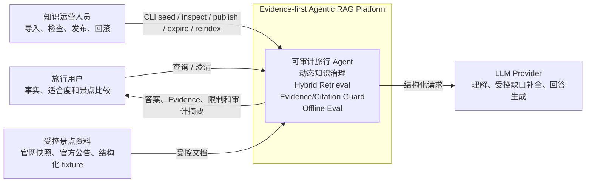
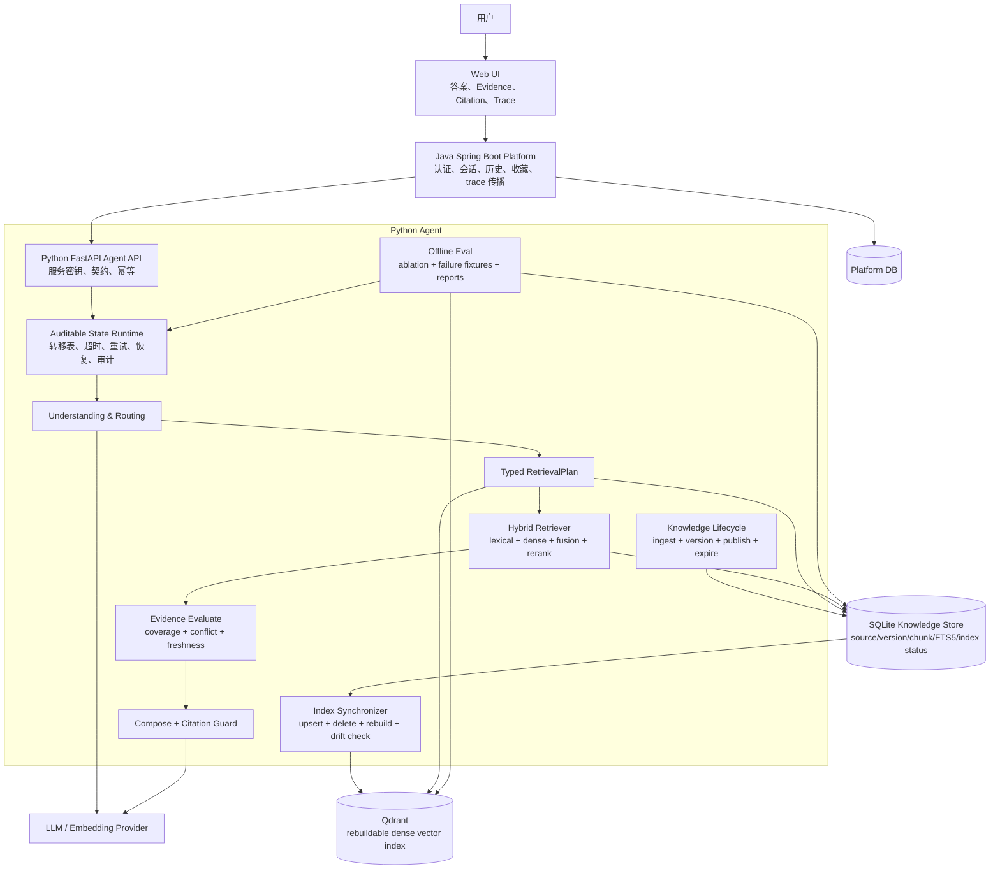
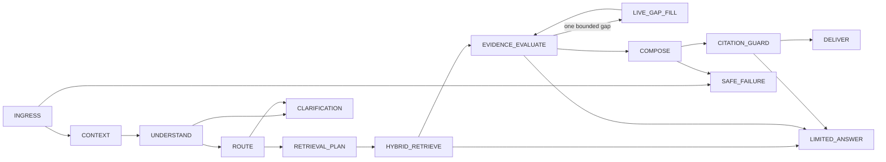

# Evidence-first Agentic RAG 修订设计

**日期：** 2026-09-02  
**状态：** 已批准  
**适用分支：** `codex/evidence-agent-consolidation`

本文档修订并取代 `2026-09-01-evidence-agent-consolidation-design.md` 中关于纯 FTS5 RAG 的检索设计。此前讨论过的 Neo4j/知识图谱方向未进入实现，现明确不采用。

## 1. 决策摘要

项目最终定位：

> Evidence-first Agentic RAG Reliability Platform

只保留四项业务能力：

- 景点事实查询。
- 景点适合度建议。
- 景点比较。
- 多轮澄清。

只突出五项技术能力：

1. 显式、可审计的 Agent 状态链。
2. 景点知识的版本、发布、失效和回滚治理。
3. FTS5 + Qdrant 的混合检索与确定性重排。
4. Evidence 冲突、缺口、Claim 引用和安全拒答。
5. 可复现的检索消融、故障注入和端到端 Eval。

不实现 Neo4j、知识图谱、GraphRAG、Text2SQL、Data Analysis Agent、网页爬虫、行程规划、附近推荐、实时人流预测、评论挖掘和票务平台聚合。

## 2. 为什么不采用知识图谱

景点信息主要由开放时间、票价、预约、交通、无障碍、临时公告等自然语言事实组成，天然适合文档版本、chunk、检索和引用链。

在仅有 8 个景点的作品集语料中，实体间关系较浅。使用 Neo4j 很容易退化为把景点字段搬进图数据库，无法自然体现多跳推理价值。要做出可信知识图谱，还需要本体、实体对齐、关系抽取、发布治理、Cypher 安全和图查询 Eval，其工作量不小于混合 RAG，并会削弱项目的招聘关键词匹配度。

本项目的差异化不依赖图数据库，而依赖：

- 知识生命周期治理。
- 混合召回和索引一致性。
- 逐状态错误控制。
- Claim 级来源追溯。
- 真实 Eval 指标和 BadCase 分析。

## 3. C4 Level 1：系统上下文



信任边界：

- 外部资料进入知识库前必须绑定 source URL 和 document version。
- LLM 输出不能直接发布为 active 知识。
- 向量索引不是事实源，必须经过 SQLite active-version 校验。
- 用户不能直接提交检索语句、过滤表达式或索引操作。

## 4. C4 Level 2：容器架构



## 5. 数据职责

### 5.1 SQLite：唯一知识事实源

保留并完善当前已经实现的表：

```text
attraction
source_document
document_version
fact_chunk
fact_chunk_fts
retrieval_log
```

新增索引同步状态：

```text
index_generation
  generation_id
  corpus_version
  embedding_model
  status: pending | building | active | failed | superseded
  started_at
  completed_at
  indexed_chunk_count
  failure_code

chunk_index_state
  chunk_id
  generation_id
  qdrant_point_id
  content_hash
  status: pending | indexed | failed | deleted
  last_attempt_at
```

SQLite 决定：

- 哪个 document version 是 active。
- 哪些 chunks 可以参与回答。
- 哪些内容已 superseded、expired、pending 或 rejected。
- Qdrant 当前索引是否与 active corpus 收敛。

### 5.2 Qdrant：可重建的派生索引

每个 point 对应一个 `FactChunk`，包含：

```text
vector
chunk_id
attraction_id
fact_type
document_version_id
content_hash
source_authority
valid_from
valid_to
corpus_version
embedding_model
```

Qdrant 不保存发布状态的最终真值。即使 payload 标记 active，查询结果仍必须回查 SQLite。Qdrant 丢失、污染或版本漂移时可以从 SQLite 重建。

### 5.3 Embedding Provider

通过端口隔离：

```python
class EmbeddingProvider(Protocol):
    @property
    def model_id(self) -> str: ...
    def embed_documents(self, texts: list[str]) -> list[list[float]]: ...
    def embed_query(self, text: str) -> list[float]: ...
```

- 默认离线测试使用 deterministic fake embedder。
- 手动真实评测使用中文 embedding adapter。
- embedding model 变化必须创建新 index generation，不允许混用向量。

## 6. 知识维护流程

```text
受控文档
→ normalize
→ content hash
→ pending DocumentVersion
→ fact chunk validation
→ publish transaction
→ supersede previous active version
→ create index generation / sync task
→ embed active chunks
→ Qdrant upsert
→ consistency check
→ generation active
```

规则：

- 相同 source + content hash 不创建新版本。
- 低可信来源保持 pending。
- publish 不等待查询请求触发。
- live gap 结果只作为当前 run 的 transient Evidence；如需维护，只能写 pending。
- reindex 必须幂等。
- 查询期间若 index generation 非 active，进入 lexical-only 降级。
- 不建设知识管理前端，只提供 CLI：

```powershell
python -m app.evidence.knowledge.cli seed ...
python -m app.evidence.knowledge.cli publish ...
python -m app.evidence.knowledge.cli expire ...
python -m app.evidence.knowledge.cli reindex ...
python -m app.evidence.knowledge.cli inspect ...
```

## 7. 混合检索设计

### 7.1 RetrievalPlan

`UNDERSTAND` 和 `ROUTE` 不生成数据库查询，只生成：

```text
task_type
attraction_ids
fact_types
query_text
as_of
filters
top_k
subtask_id
```

只允许三个 retrieval task：`fact_query`、`suitability`、`comparison`。

### 7.2 检索管线

```text
RetrievalPlan
→ FTS5 lexical candidates
→ EmbeddingProvider.embed_query
→ Qdrant dense candidates
→ RRF fusion
→ SQLite active-version post-filter
→ source/freshness/fact-type rerank
→ Top-K Evidence
→ RetrievalReport
```

建议默认值：

- lexical candidate count：20。
- dense candidate count：20。
- RRF `k = 60`。
- rerank candidate count：8。
- final Evidence：3。
- 单个 comparison 子任务独立执行，不共享召回结果。

确定性重排：

```text
final_score =
  0.60 * normalized_rrf
  + 0.20 * source_authority
  + 0.15 * freshness
  + 0.05 * fact_type_match
```

真实实验可以调整权重，但必须记录 config digest，并在 Eval 报告中展示。

### 7.3 RetrievalReport

无论命中或失败都必须返回：

```text
query_id
subtask_id
retrieval_plan
corpus_version
index_generation
embedding_model
lexical_attempt
dense_attempt
fusion_candidates
post_filter_rejections
final_hits
coverage_hints
degradation
latency_breakdown
```

## 8. 唯一 Agent 状态链



每个状态仍使用已实现的：

```text
StateContext → StateHandler → StateResult
```

`RAG_RETRIEVE` 从状态枚举和转移表中删除，替换为 `RETRIEVAL_PLAN` 与 `HYBRID_RETRIEVE`。

## 9. 逐状态错误与恢复

| 状态 | 错误 | 恢复 |
|---|---|---|
| `INGRESS` | 空输入、非法长度、重复请求 | 验证失败 safe failure；重复请求幂等返回 |
| `CONTEXT` | session/history 加载失败 | 创建 session；降级为空上下文并审计 |
| `UNDERSTAND` | LLM timeout、JSON/实体错误 | repair 一次；规则 fallback；再不足则 clarification |
| `ROUTE` | 非支持任务、事实维度非法 | 只允许三个任务；否则 clarification |
| `RETRIEVAL_PLAN` | 景点未解析、filter 冲突 | 修正一次；失败 clarification |
| `HYBRID_RETRIEVE` | Qdrant、FTS5、Embedding、index drift、zero hit | 单路降级；active post-filter；全失败 gap fill |
| `EVIDENCE_EVALUATE` | Evidence 非法、冲突、硬事实缺失 | 丢非法项、保留冲突、一次 gap fill、limited answer |
| `LIVE_GAP_FILL` | timeout、429、empty、malformed | 一个逻辑任务最多两次 attempt；仅 transient/pending |
| `COMPOSE` | 结构或 citation ID 非法 | repair 一次；确定性 Evidence 模板 |
| `CITATION_GUARD` | 硬事实无 active Evidence/URL | 删除事实；limited answer 或 safe failure |
| `DELIVER` | schema、幂等持久化错误 | schema 修复；幂等写入 |

### 9.1 Hybrid Retrieve 子尝试

FTS5 与 Qdrant 不拆成两个主状态，而在 `HYBRID_RETRIEVE` 中记录两个独立 `ExecutionAttempt`：

```text
phase_started: HYBRID_RETRIEVE
execution_attempt: lexical / succeeded
execution_attempt: dense / timeout
recovery: lexical_only
active_version_check: accepted=8 rejected=2
phase_recovered: HYBRID_RETRIEVE
transition_committed: EVIDENCE_EVALUATE
```

### 9.2 审计字段

- `run_id/session_id/query_id/trace_id`
- `state/attempt/status/duration`
- `from_state/to_state`
- `failure_class/failure_code`
- `recovery_strategy`
- `corpus_version/index_generation`
- `retriever/embedding/config_digest`
- input/output artifact reference 与 digest

不记录原始 Prompt、完整用户上下文或 chain-of-thought。

## 10. Evidence 与 Citation

每个最终事实必须具有：

```text
AnswerClaim
→ Evidence
→ FactChunk
→ DocumentVersion
→ SourceDocument.url
```

Evidence provenance 至少包含：

```text
source_id
document_version_id
chunk_id
content_hash
locator
valid_from
valid_to
retrieval_channels
retrieval_score
corpus_version
```

Citation Guard 采用 fail closed：

- Evidence 不是 active version：拒绝。
- source URL 缺失：拒绝硬事实。
- claim 引用不存在的 evidence ID：删除 claim。
- 冲突未披露：进入 limited answer。
- 所有硬事实都被删除：safe failure。

## 11. Eval 数据

最小语料：

- 8 个景点。
- 60–100 个 active chunks。
- 12 个 superseded/expired chunks。
- 8 个 pending/rejected chunks。
- 6 组来源冲突。
- 5 个文档更新与索引重建场景。

事实类型限定为：

```text
opening_hours
ticket_price
reservation
transport
accessibility
visitor_notice
general_description
```

约 60 个 Eval cases：

| Suite | 数量 | 内容 |
|---|---:|---|
| Hybrid Retrieval | 20 | lexical、dense、hybrid 召回与排序 |
| Metadata/Version | 10 | 景点、事实类型、时间和 active 版本 |
| State Routing | 8 | fact、suitability、comparison、clarification |
| Evidence/Conflict | 6 | 来源等级、冲突与覆盖率 |
| Citation | 6 | Claim-Evidence 对齐 |
| Failure Recovery | 6 | Qdrant、FTS5、Embedding、live tool 故障 |
| Multi-turn/Comparison | 4 | session 与双景点独立检索 |

## 12. Eval 指标与门槛

检索：

```text
Recall@3                    >= 0.90
MRR                         >= 0.85
nDCG@5                      >= 0.90
metadata filter accuracy     = 1.0
expired/superseded leakage   = 0
provenance completeness      = 1.0
```

可靠性：

```text
state path accuracy          >= 0.95
illegal transition count     = 0
stale vector rejection rate  = 1.0
index rebuild consistency    = 1.0
recovery fixture pass rate   = 1.0
unsupported hard facts       = 0
citation precision           >= 0.95
abstention precision         >= 0.90
replay consistency           = 1.0
```

延迟记录 P50/P95，但不在离线 CI 设置脆弱的绝对延迟门槛。

## 13. 检索消融

最终报告必须比较：

```text
lexical-only
dense-only
hybrid
hybrid + source/freshness rerank
```

README 只写实际运行值，例如：

> Hybrid retrieval 相比 lexical-only 将 Recall@3 从 X 提升至 Y；active-version post-filter 将过期事实泄漏率从 X 降至 0。

禁止预填结果或只展示目标值。

## 14. 故障注入

- Qdrant timeout → lexical-only。
- Embedding failure → lexical-only。
- FTS5 failure → dense-only。
- Qdrant 残留 superseded point → SQLite post-filter 删除。
- 两路零召回 → 一次 live gap fill。
- live tool timeout/429/malformed → limited answer。
- composition 产生非法 citation → Citation Guard 删除事实。

每个 fixture 必须断言失败分类、attempt 数、recovery strategy、最终状态和审计事件。

## 15. 测试与运行环境

- 单元测试：版本治理、RRF、rerank、filter、状态转移。
- SQLite repository tests。
- Qdrant local-mode tests：向量写入、过滤、重建。
- Docker integration tests：真实 Qdrant server。
- Python API 状态链 tests。
- Java-Python contract tests。
- Web Evidence/Citation 展示纯函数 tests。
- 默认 CI 使用 deterministic fake embedder，无真实 LLM、无公网。
- 手动 profile 使用真实中文 embedding 和 LLM。

## 16. ADR

### ADR-RAG-001：选择 Hybrid RAG，不选择知识图谱

**Context：** 招聘需求与景点自然语言事实更匹配 RAG；小语料关系密度不足以证明图谱价值。  
**Decision：** 使用动态版本知识库、lexical+dense 混合检索、Evidence/Citation 和 Eval。  
**Consequence：** 获得直接 RAG 项目经验；不展示 Neo4j，但减少无业务价值的技术扩张。

### ADR-RAG-002：SQLite 是事实源，Qdrant 是派生索引

**Alternatives：** 纯 SQLite、PostgreSQL+pgvector、SQLite+Qdrant。  
**Decision：** 保留 SQLite 生命周期实现，引入 Qdrant 作为可重建向量索引。  
**Consequence：** 需要同步与漂移治理；同时可以演示向量数据库、降级和一致性控制。

### ADR-RAG-003：确定性 RetrievalPlan 与融合

**Alternatives：** LLM 自由选择检索器、单 dense、受约束 hybrid pipeline。  
**Decision：** 使用类型化计划、固定召回通道、RRF 和确定性重排。  
**Consequence：** 能离线重放和评测；新事实类型必须显式注册。

### ADR-RAG-004：默认离线、真实模型手动评测

**Decision：** CI 使用 fake embedder/fake LLM；Qdrant local mode 验证协议，Docker 验证真实服务。  
**Consequence：** CI 快速、稳定、无密钥；真实模型效果通过独立报告提供。

## 17. 成功标准

- 只有一套 Agent 状态链。
- 每个状态有输入、输出、合法转移、超时、attempt、recovery 和 audit test。
- SQLite 版本治理与 Qdrant 派生索引职责清晰。
- 混合检索包含 lexical、dense、fusion、active post-filter 和 rerank。
- Qdrant 或 embedding 故障时能够可审计降级。
- 每个硬事实都能沿 Claim → Evidence → Chunk → Version → URL 回溯。
- 约 60 个离线 cases 达到规定门槛。
- 检索消融报告展示真实提升或失败，不隐藏 BadCase。
- Python、Java、Web、Qdrant 集成和离线 Eval 均有可运行命令。
- 已裁剪能力不再出现在运行时和配置中。
