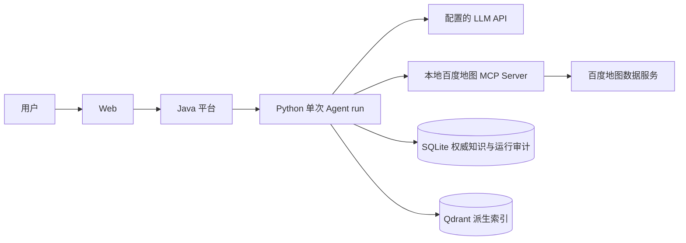
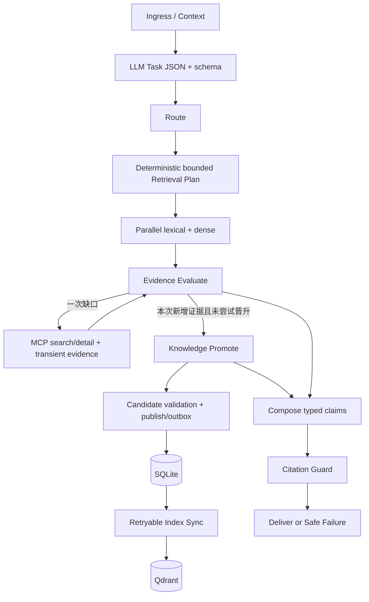

# Resume Capability Closure Implementation Plan

> **For Claude:** REQUIRED SUB-SKILL: Use superpowers:executing-plans to implement this plan task-by-task.
>
> 本环境实际可用技能为 `executing-plans`（@executing-plans）；不存在 superpowers 命名空间时使用该技能，不虚构工具。

**Goal:** 在不恢复已裁剪旅游能力的前提下，让简历中的 LLM 结构化理解、并行 Hybrid Retrieval、百度地图 MCP stdio、受控 Knowledge Promotion、逐状态审计和回放都有生产接线、失败测试和可复现证据。

**Architecture:** 延用 Java 平台 + 单次 Python Agent run + SQLite 权威库 + Qdrant 派生索引。模型只生成受约束提议，确定性代码负责实体绑定、时间、预算、来源与发布策略。MCP 临时证据先服务当前请求，知识候选在显式旁支中校验与发布，索引通过 SQLite 持久待办恢复。

**Tech Stack:** Python/FastAPI/Pydantic、现有 Anthropic-compatible LLM client、SQLite/FTS5、Qdrant、官方 MCP Python SDK、百度地图官方 Node stdio Server、pytest、Java/Spring Boot、Vite、GitHub Actions。

---

## 0. 状态、目录与执行约束

- 日期：2026-09-04；基线：`4e339f16e0ccffce3a0e7588392e75fd1c1b5231`。
- 状态：**用户已批准开始批次 A（Task 0–3）；B–D 尚未执行。本文不表示简历能力已完成。**
- 专用 worktree：`E:/学习文件/研究生/就业/Agent学习/Evidence-first Travel Intelligence Agent/.worktrees/resume-capability-closure`
- 分支：`codex/resume-capability-closure`。
- 文中文件路径均相对于上述 worktree 根目录；Python 命令默认在 `apps/agent-python` 执行，Java 命令在 `apps/api-java`，npm Web 命令在 `apps/web`。每次切换位置必须显式确认。
- 根目录未跟踪的 `项目流程图.png` 属于用户，不移动、不提交、不删除。
- 批次 A 已获执行批准。代码按本文逐任务红→绿→回归→提交，禁止跳过测试、降低原 13 项门禁或重新引入 itinerary/nearby/crowd/review/ticket crawler。
- Task 0 本轮 Python 基线：127 passed / 1 skipped（真实 Qdrant opt-in）；原离线评测 13 项门禁通过。Java/Web 本批未改动，未重跑。
- 不在本轮引入 Kafka、Celery、Neo4j、开放式工具规划、全网爬虫、多用户知识权限系统。
- 每批结束运行所有受影响测试并复核生产接线，不能只证明 isolated handler 可调用。

## 1. 简历逐条对照：真实差距

| 简历承诺 | 当前证据 | 判定与补齐 |
|---|---|---|
| LLM 结构化理解 | `app/main.py:build_runtime` 未传 primary_understanding；UnderstandingHandler 支持注入，但默认走规则 | 未生产接通；添加新强类型 adapter 并从 composition root 接线 |
| LLM 驱动 Retrieval Plan | `states/retrieval_planning.py` 确定性构建，固定 top_k=3、as_of=clock，忽略明确日期 | 保留受控 planner；落实 LLM Task JSON 的 fact/time/约束字段，不让 LLM 生成 SQL/任意过滤器 |
| 并行 Hybrid Retrieval | `evidence/retrieval/hybrid.py` 先 lexical 后 dense；state handler 同步调用 | 目前串行、阻塞 event loop；改有界异步通道 |
| SQLite/FTS5 + Qdrant + RRF | 已有 lexical BM25、dense、融合、过滤、重排与测试 | 保留；扩展自然中文无空格查询、真实 embedding 验收 |
| stdio MCP 百度地图接入 | `packages/tools/mcp/adapters/baidu_map_adapter.py` 有旧广域 adapter；主链 gap_tool 默认 UnavailableGapFillTool | 旧代码存在不等于接通；只新接 search/detail 白名单 |
| stdio 通信可靠性 | `packages/tools/mcp/stdio_client.py` 使用 Content-Length，按下一条响应直接匹配 id | 不符合标准换行分帧；主链改用官方 SDK，不复制旧协议实现 |
| Evidence-to-Knowledge | live handler 仅有未接线的 pending_writer；缺 Candidate、验证、事务发布/同步 | 核心缺口，Task 7–10 |
| Citation Guard | 校验 URL/ID/hash/status，但未严格验证 claim 内容、景点、fact、时效 | 接入生成模型前必须补齐，不能把“有引用”当成“引用支持事实” |
| Replay | 仅恢复 retrieval_plan/hybrid_retrieve；不恢复 transient/gap/晋升决策 | 增加 MCP 路径的无外部副作用回放 |
| Eval 发布门禁 | 71 个受控案例，hash embedding；all gates 未覆盖全部新增业务，bad_cases 主要是阈值失败文字 | 加结构化 BadCase、故障与晋升硬门禁；区分 offline/live/real embedding |
| 版本安全 | publish 可激活 superseded；ingest 可更新 source 元数据，hash 仅覆盖 document.content | 加合法状态转换、来源绑定与 canonical version hash，防止自动晋升污染 |

另：AGENTS.md 所指 `tests/test_removed_capabilities_gate.py` 不存在；实际 gate 位于 `tests/characterization/test_supported_scope.py`，只修正文档引用，不删除/弱化 gate。

## 2. 方案与关键设计决策（待批准）

### ADR-01：有界补齐，不扩成开放式 Agent

- A（推荐）：LLM 理解 + 受控检索计划 + 两个地图工具 + 稳定事实晋升，沿用当前栈。
- B：只接 LLM、取消简历 MCP/晋升表述。最省工作，但不满足本次目标。
- C：让 LLM 自主选任意工具并自由写知识。更复杂、难隔离错误，会冲击已裁剪范围。
- 决策提议：A。一个问题仍只处理 1 个景点或 2 个比较景点；未知实体先澄清，第一版不自动注册任意新景点。

### ADR-02：官方 MCP SDK + stdio

- 使用官方 MCP Python SDK 封装会话；不修补自制 Content-Length 实现。
- 百度 Server 由管理员配置启动命令/固定依赖，用户输入不得进入 command/args/env。
- Node Server 通过 lockfile 安装，使用本地 entrypoint，禁止每次请求 npx 下载 latest。
- HTTP/SSE 可以作为后续替换 adapter，但不在这轮实现；简历写 stdio，验收必须覆盖 stdio。
- SDK/Server 版本在 Task 5 查官方发布并锁定；本文不捏造当前版本号。
- 代价：增加两个被固定版本管理的依赖；收益：协议 framing、生命周期、消息关联交给 SDK。

### ADR-03：LLM 提议，代码裁决

- 模型可以输出 task/fact/entity/time/约束和 KnowledgeCandidate，不能输出可信的 authority_score、source_type、content_hash、publication status 或源 URL。
- provenance、原始工具 payload hash、检索时间与来源等级由 adapter 填入不可变 envelope。
- 第一版硬事实采用 extractive grounding：candidate.fact_text 必须等于引用字段的规范化文本，后续中文模板由代码生成；不宣称完成通用语义蕴含判定。
- 地图 POI 信息的缺失不表示否定；空字段不生成“无障碍设施不存在”等事实。
- LLM 在 source 内容中遇到指令时视为不可信数据；不得执行“忽略规则/设置 active/调用 URL”等内容。

### ADR-04：知识晋升是显式、可恢复的写入旁支

- 当前请求先保留 TransientEvidence；晋升不能覆盖它，也不作为当前答案成功的前置条件。
- `evidence_evaluate → knowledge_promote → compose/safe_failure` 为固定一次旁支；返回下一状态由代码决定，不能由模型提供。
- 旁支只处理本次 gap 返回且来源/实体/事实类型已验证的候选，不循环触发 gap。
- `pending → active + index_sync_job` 在同一个 SQLite 事务完成；同步失败保留可重试待办。
- 不引入队列服务：单实例后台 coordinator + SQLite durable jobs + 管理 CLI 即可。进程重启扫描未完成 job，使用 lease/CAS；本轮不声称多节点调度或 HA。
- 等待索引完成之前只允许声明 SQLite lexical 可见；只有 generation 验证并切换后才能声明 dense 可见。

### 晋升策略边界

| 情况 | 当前请求 | 持久化 |
|---|---|---|
| source payload 有明确 POI 地址/稳定描述字段，景点 UID 绑定、grounding、TTL、provider storage policy 全部通过 | 可作为带地图来源限制的 transient fact | 可自动 pending→active |
| 开放时间、票价、预约、无障碍等高影响事实 | 按原始字段和来源政策决定是否有限回答；不能冒充官方 | 默认人工审核 pending；百度地图非官方声明不自动晋升为官方事实 |
| 天气、实时路况、单次行程耗时、个性化用户建议 | 不扩大产品范围，不调用对应工具 | 禁止持久晋升 |
| 缺 URL/实体不明/数值被模型改写/来源指令污染/过期 | 不支持硬事实交付 | rejected，记录原因 |
| 内容相同但有效期/来源绑定/事实集合变化 | 按新快照验证 | 必须触发新版本校验，不能只靠正文 hash 跳过 |
| 提供商数据存储权限未确认 | 最多按已允许用法处理当前请求 | promotion disabled / pending，不擅自假设可永久缓存 |

自动发布初始白名单只放确实存在且政策允许的稳定字段，例如 general_description 中的 POI 地址。交通只表示明确来源字段里的到达信息，不恢复路线规划能力。有效期是保守上界，不是事实必然有效的保证。原始 payload 默认只保留脱敏、必要字段；不能把百度 Server 源码 MIT 许可当成地图数据永久缓存授权。

## 3. 目标边界图





图中省略的失败边仍由转换表列出；clarification/safe_failure/failed 保留。知识写入只在第一次正常 run 发生，replay 禁止执行模型/MCP/promotion/index。

## 4. 全局验收与可观察字段

- 所有 runtime profile：`offline` / `online` 必须明确。offline 从入口就禁止外部调用；online 未配置凭据时 readiness 反映缺失，不能静默把 rule-only 标成 LLM 成功。
- audit 至少包含 run/query/trace/subtask/attempt、duration、failure_code、recovery、tool_name、schema_hash、payload_digest、candidate_id、policy_version、index job/generation、配置摘要；不包含 key、带 AK 的 URL、完整 prompt 或思维链。
- 逻辑 gap 任务上限 1；允许 search→detail 两个只读工具；每工具最多 2 attempts，因此 tools/call 最大 4。initialize/tools/list 单独预算（分页最多 3 页、schema 总大小 256 KB），不能混算成免费无限操作。
- 总 gap deadline 建议 20 秒；单工具默认 5 秒，超时后 session 按策略废弃再初始化一次；只有只读工具允许 retry。
- 理解 LLM 最多 2 次（初次+schema repair），candidate LLM 最多 2 次；全部使用统一 deadline，避免 client 隐藏 retry 与状态 retry 相乘。
- 单次最多 4 个 candidates；candidate 阶段失败后仍将已有 transient evidence 交给 guard。
- SQLite 写入/持久审计不可用时不返回“晋升成功”；受影响写操作失败关闭，当前回答是否安全由现有 Evidence 决定。
- 在线发布需留下脱敏的真实 LLM + 百度 MCP + real embedding smoke 结果；只有 fake server 通过不得写“真实接入验收完成”。

## 5. 分批、依赖与任务

批次 A：Task 0–3（契约、LLM、计划）。
批次 B：Task 4–6（并行、MCP、临时证据）。
批次 C：Task 7–10（候选、版本、事务与生产接线）。
批次 D：Task 11–14（安全、回放、Eval、跨栈交付）。

每 Task 都按 5 步执行；单个 Step 过大时拆成一个测试/一个方法的小循环，每轮 2–5 分钟。Task 14 完成前不合并、不推送。

### Task 0: 固化基线与事实声明

**Files**
- Modify: `AGENTS.md`（scope gate 的真实路径）。
- Create: `docs/architecture/RESUME_CAPABILITY_MATRIX.md`。
- Existing tests: `apps/agent-python/tests/characterization/test_supported_scope.py`。

1. 保存本文第 1 节的证据矩阵，每项列 production factory、行为测试、live 验收证据；未完成写 missing，不写 done。
2. 运行 `python -m pytest -q` 和现有 71-case 命令。预期基线全绿，真实服务测试跳过有原因；失败先记录 BadCase，禁止直接继续加功能。
3. 仅修正 AGENTS 中 gate 路径；保留所有旧门禁数值和原数据集。
4. 运行 `python -m pytest tests/characterization/test_supported_scope.py -q`，预期所有 scope 检查通过。
5. 根目录提交：`git add AGENTS.md docs/architecture/RESUME_CAPABILITY_MATRIX.md`；`git commit -m "docs: record resume capability baseline"`。

### Task 1: 定义受限 Task、MCP 与候选契约

**Files**
- Create: `apps/agent-python/app/understanding/task_request.py`
- Create: `apps/agent-python/app/evidence/knowledge/candidate.py`
- Create: `apps/agent-python/app/integrations/mcp/contracts.py`
- Modify: `apps/agent-python/app/evidence/claim_decision.py`（TransientEvidence provenance）。
- Test: `apps/agent-python/tests/knowledge/test_candidate_contracts.py`
- Test: `apps/agent-python/tests/states/test_task_request.py`

1. 写红测：额外 publish 字段被拒绝；candidate 不允许自行指定 URL/authority；未知 FactType、无时区日期、无 grounding 引用均失败。
2. 运行 `python -m pytest tests/knowledge/test_candidate_contracts.py tests/states/test_task_request.py -q`，预期新模块缺失/契约测试失败。
3. 实现严格 schema（下面是必需最小契约，所有业务模型 `extra="forbid"`）：

```python
class GroundingRef(BaseModel):
    model_config = ConfigDict(extra="forbid")
    evidence_id: str = Field(min_length=1)
    field_path: str = Field(min_length=1)  # validated allowlisted JSON Pointer
    quote: str = Field(min_length=1, max_length=2000)

class KnowledgeCandidate(BaseModel):
    model_config = ConfigDict(extra="forbid")
    attraction_id: str
    fact_type: FactType
    fact_text: str = Field(min_length=1, max_length=2000)
    references: list[GroundingRef] = Field(min_length=1, max_length=4)
```

TaskRequest 仅允许 fact_query/suitability/comparison/clarification，携带 entities、constraints、fact_types、timezone-aware requested_as_of；转换到现有 NormalizedUserRequest 在单独函数完成。McpEvidenceEnvelope 保存 server/tool/schema_hash/call_id/payload_hash/retrieved_at/provider_entity_id/sanitized_fields/source_url，全部由代码生成。TransientEvidence 增加 subtask_id、content_hash、valid_to、provenance_ref，保留兼容默认但新入口强校验。
4. 重跑上面命令并测试旧 fixture 兼容；预期红测全绿，旧 contract 不被破坏。
5. 提交上述文件，message：`feat: define bounded task and promotion contracts`。

### Task 2: LLM 结构化理解真实接线

**Files**
- Create: `apps/agent-python/app/understanding/primary_understanding.py`
- Create: `apps/agent-python/app/understanding/prompts/task_request.system.md`
- Modify: `apps/agent-python/app/integrations/llm/client.py`
- Modify: `apps/agent-python/app/orchestration/states/llm_understanding.py`
- Modify: `apps/agent-python/app/config.py`
- Test: `apps/agent-python/tests/states/test_primary_understanding.py`

1. fake LLM 返回一次 malformed JSON、随后合法 TaskRequest；断言 exact calls=2、repair=true、正常任务保留约束/日期；再增加 auth failure 不重试、两次 parse error→规则回退、规则不足→clarification。
2. 运行 `python -m pytest tests/states/test_primary_understanding.py -q`，预期 adapter 未实现而失败。
3. 新 adapter 实现 `normalize(raw_query, conversation_context, repair=False)`，只做一次 transport request、严格 parse/validate/map。控制 retry 的唯一所有者是 UnderstandingHandler；旧 LLMUnderstandingSubAgent 内含 fallback/repair，不直接套一层造成 2×3 次调用。transport 使用真正 async client 或受控 executor，超时/取消可释放资源。审计保留 model/prompt/schema version，不保存 raw prompt。来源内容与系统指令分隔，禁止 prompt 中授予任意工具/写入权限。
4. 重跑测试及 `tests/states/test_understand_route.py`，预期模型成功/一次 repair/规则降级/澄清四条路径均有区分。
5. 提交，message：`feat: add strict primary understanding adapter`。生产装配由 Task 10 完成，矩阵此时只能标 adapter tested。

### Task 3: 保留时间与用户约束的 Retrieval Plan

**Files**
- Modify: `apps/agent-python/app/orchestration/states/retrieval_planning.py`
- Modify: `apps/agent-python/app/evidence/retrieval/contracts.py`
- Create: `apps/agent-python/app/planning/retrieval_query_builder.py`
- Test: `apps/agent-python/tests/states/test_retrieval_planning.py`
- Test: `apps/agent-python/tests/retrieval/test_natural_queries.py`

1. 写红测：明确日期不被 clock 覆盖；比较实体各一计划且不串 subtask；无空格中文“故宫几点开门”生成可命中查询；top_k 超界、未来日期无覆盖均不猜测。
2. 运行 `python -m pytest tests/states/test_retrieval_planning.py tests/retrieval/test_natural_queries.py -q`，预期当前忽略日期/词法表达失败。
3. planner 规则：

```python
as_of = task.requested_as_of or clock()
top_k = min(settings.knowledge_retrieval_top_k, 5)
# Entity IDs and subtask IDs are generated/validated by code, not LLM.
lexical_query = query_builder.from_entity_and_fact_types(entity, fact_types)
```

保留 user_constraints、原 query、query rewrite 于计划产物；不把预算/Top-K/SQL交给模型任意填写。地址等事实表达只能映射到本项目已有 FactType。跨日/无时区按请求时区解析；不能把今天抓取的地图快照当历史事实回答。
4. 同一测试命令全绿，现有 retrieval eval不回归。保留原始问题以便 dense，而 lexical 使用有限别名/事实词扩展，不因标准中文无空格而全部 miss。
5. 提交，message：`feat: preserve bounded retrieval intent and time scope`。

### Task 4: 并行检索与独立超时

**Files**
- Modify: `apps/agent-python/app/evidence/retrieval/hybrid.py`
- Modify: `apps/agent-python/app/orchestration/states/hybrid_retrieval.py`
- Create: `apps/agent-python/app/execution/bounded_io.py`
- Test: `apps/agent-python/tests/retrieval/test_parallel_retrieval.py`
- Modify: `apps/agent-python/evals/runner.py`

1. 用 asyncio.Event barrier 测试两通道都已 started 才放行；不用脆弱的“总耗时小于某毫秒”作为唯一证据。增加 dense 超时→lexical_only、双失败、取消、比较隔离和超时后 worker 不泄漏测试。
2. `python -m pytest tests/retrieval/test_parallel_retrieval.py -q`，预期缺 async 入口/不能同时抵达 barrier。
3. 增加生产 `aretrieve(plan)`，两通道独立 timeout，通过 gather(return_exceptions=True) 收集结果；状态 handler await。SQLite 连接在 worker 内创建。同步 embedding/Qdrant 若用 executor，必须限定 pending/running 数并在底层 future 真完成后释放槽；wait_for 超时不能假装线程已杀死。Qdrant local 对象禁止未经验证多线程共用，dense 用专属串行 lane，server 模式可用原生 async adapter。保留同步 eval 兼容包装但不在 event loop 里调用 asyncio.run。
4. barrier 与故障测试全绿；`python -m pytest tests/retrieval tests/states/test_hybrid_retrieval.py -q` 全绿。
5. 提交，message：`feat: run retrieval channels with bounded concurrency`。

### Task 5: 标准 stdio MCP 会话与工具发现

**Files**
- Create: `apps/agent-python/app/integrations/mcp/stdio_session.py`
- Create: `apps/agent-python/app/integrations/mcp/tool_catalog.py`
- Create: `apps/agent-python/tests/fakes/stdio_mcp_server.py`
- Create: `apps/agent-python/tests/integrations/test_stdio_session.py`
- Modify: `apps/agent-python/requirements.txt`
- Create: `infra/baidu-mcp/package.json`, `infra/baidu-mcp/package-lock.json`

1. 用独立子进程 fake MCP server 做红测：initialize→tools/list→tools/call；混入 notification、stderr、大返回、EOF、超时、isError、分页超限、schema 漂移；退出/取消后无子进程残留。
2. `python -m pytest tests/integrations/test_stdio_session.py -q`，预期当前无合规新 adapter。
3. 查官方 SDK/Server 发布，锁定互相兼容的版本；`pip index versions mcp`、`npm view @baidumap/mcp-server-baidu-map version bin`；安装需要网络时请求权限，不能填猜测版本。使用官方 `ClientSession`、`stdio_client`、`StdioServerParameters`，async context 生命周期由 FastAPI lifespan 单一任务管理，避免跨 asyncio task 销毁 AnyIO cancel scope。保存规范化 inputSchema 和 hash，调用前 JSON Schema 验证；工具名须经过白名单与实际发现双重匹配。Windows 启动隐藏子进程，不打印 env/key。stderr有界脱敏排空，stdout只走协议。
4. fake stdio 独立进程全绿；测试不依赖百度 AK、不下载 Server、不调用真实模型。官方百度 Server 只有 online smoke 才启动。部署依赖使用 lockfile 和本地 bin，不采用请求时 npx latest。
5. 提交，message：`feat: add standards compliant bounded mcp session`。不导入旧广域 adapter 的 nearby/weather/route 路径。

### Task 6: 百度 search/detail → Transient Evidence

**Files**
- Create: `apps/agent-python/app/integrations/mcp/baidu_gap_tool.py`
- Create: `apps/agent-python/app/evidence/baidu_normalizer.py`
- Modify: `apps/agent-python/app/orchestration/states/live_gap_fill.py`
- Modify: `apps/agent-python/app/governance/tool_budget.py`
- Test: `apps/agent-python/tests/states/test_baidu_gap_fill.py`
- Test: `apps/agent-python/tests/states/test_live_gap_fill.py`

1. 测试 known attraction 的 missing fact；比较场景第二景点缺证必须补第二景点，不能总取 plans[0]；同名多 UID→澄清/安全失败；source无 URL、不含所需字段、错误城市拒绝。
2. `python -m pytest tests/states/test_baidu_gap_fill.py tests/states/test_live_gap_fill.py -q`，预期接线/计数/比较选择失败。
3. 只允许 `map_search_places` 与 `map_place_details`。工具发现后的参数按 schema 生成，确定 UID 后才能查详情；当入参已有可信 UID 可跳过 search。source URL必须是返回的或由验证 UID 按官方公开格式构造的实际 POI 链接，不能拿 MCP endpoint/README 当事实来源，禁止带 AK。保留真实字段定位、原值、provider标识、hash、valid_to。logical_gap_tasks、tools/call_attempts、LLM attempts 分开计数；两工具各最多2次，总共4，不再把整个链算一次调用。
4. 断言被允许工具名单 exact match；预算消耗=实际调用次数，超时/429/schema/不支持事实分类明确。完全失败回到 Evidence Evaluate，已有其他景点证据不丢弃。
5. 提交，message：`feat: connect bounded baidu gap retrieval`。

### Task 7: LLM KnowledgeCandidate 提取与五类验证

**Files**
- Create: `apps/agent-python/app/evidence/knowledge/candidate_extractor.py`
- Create: `apps/agent-python/app/evidence/knowledge/promotion_policy.py`
- Create: `apps/agent-python/app/evidence/knowledge/promotion_validator.py`
- Create: `apps/agent-python/app/evidence/knowledge/prompts/candidate.system.md`
- Test: `apps/agent-python/tests/knowledge/test_promotion_validation.py`

1. 红测包含：字段不存在、quote被篡改、不同景点、冒充官方、有效期过长、未来/过期、prompt注入、没有storage许可、禁止fact、4候选超限、模型非JSON。每个拒绝必须有具体 code。
2. `python -m pytest tests/knowledge/test_promotion_validation.py -q`，预期新 validator 缺失。
3. extractor 从**白名单脱敏字段**构造输入，LLM只返回 Task 1 schema；最多一次 repair。validator按 Schema→Grounding→Provenance→Temporal→Persistence Policy顺序检查并返回 `PromotionDecision(candidate_id, outcome, reason_codes, evidence_refs, policy_version)`。最小判断：

```python
if candidate.attraction_id != envelope.attraction_id:
    reject("entity_mismatch")
if normalize(candidate.fact_text) != normalize(resolve_allowed_pointer(envelope, ref.field_path)):
    reject("grounding_mismatch")
if not policy.storage_allowed(envelope.provider, candidate.fact_type):
    reject("persistence_policy_denied")
# Code computes URL, source_type=structured, digest and TTL; LLM never supplies these.
```

禁止仅凭 LLM self-confidence/“已验证=true”发布；stable auto白名单之外保留 pending/manual-review，不做虚假的语义等价判定。
4. 全部反例拒绝，合法 extractive 稳定事实成功；LLM转换失败时 transient evidence 仍保留，允许本次有限回答。
5. 提交，message：`feat: validate grounded knowledge candidates`。

### Task 8: 版本合法性、来源绑定与幂等

**Files**
- Modify: `apps/agent-python/app/evidence/knowledge/models.py`
- Modify: `apps/agent-python/app/evidence/knowledge/repository.py`
- Modify: `apps/agent-python/app/evidence/knowledge/schema.sql`
- Create: `apps/agent-python/app/evidence/knowledge/migrations.py`
- Test: `apps/agent-python/tests/knowledge/test_promotion_versions.py`

1. 测试旧 active supersede、拒绝 superseded/reactivation、active相同发布幂等、到期禁止发布、source_id换景点被拒、正文相同但chunk/TTL改变触发新版本、重复两个晋升并发仅1个active。
2. `python -m pytest tests/knowledge/test_promotion_versions.py -q`，预期现有 publish/正文hash策略暴露问题。
3. 明确 canonical digest 覆盖 schema_version、source binding、ordered typed facts、valid_from/valid_to；payload_hash 与知识版本 hash 分离。source_id 由 provider+validated UID+fact_type 生成，禁止模型决定。chunk_id 含版本身份，不能复用 fixture 的固定 ID 导致主键冲突。仅 pending 可转 active，active重复为 no-op；superseded/rejected/expired 不得重新激活。迁移必须非破坏、重复执行幂等，旧数据库保留兼容hash_version，不静默重写历史 Evidence。
4. `python -m pytest tests/knowledge -q` 全绿；旧数据库fixture迁移、FTS触发器及引用历史不丢。
5. 提交，message：`fix: enforce immutable knowledge version provenance`。

### Task 9: 原子发布与可恢复索引同步

**Files**
- Create: `apps/agent-python/app/evidence/knowledge/promotion_service.py`
- Create: `apps/agent-python/app/evidence/knowledge/index_jobs.py`
- Modify: `apps/agent-python/app/evidence/knowledge/schema.sql`
- Modify: `apps/agent-python/app/evidence/knowledge/repository.py`
- Modify: `apps/agent-python/app/evidence/retrieval/index_sync.py`
- Modify: `apps/agent-python/app/evidence/knowledge/cli.py`
- Test: `apps/agent-python/tests/knowledge/test_promotion_transactions.py`

1. 写崩溃测试：publish后入队前异常全回滚；Qdrant中断后active知识+pending job可恢复；重启重复处理不重复版本；两个写者同源竞态；删除旧generation失败可观察；发布期间检索不泄漏旧版。
2. `python -m pytest tests/knowledge/test_promotion_transactions.py -q`，预期当前无 outbox。
3. 在**同一 knowledge SQLite DB**新增 promotion_decision、index_sync_job；不能用 run-store 和 knowledge-store 两个库假装同事务。

```sql
-- Added by versioned migration; a job is durable before commit succeeds.
CREATE TABLE index_sync_job (
    job_id TEXT PRIMARY KEY,
    dedupe_key TEXT NOT NULL UNIQUE,
    version_id TEXT NOT NULL REFERENCES document_version(version_id),
    status TEXT NOT NULL CHECK(status IN ('pending','running','succeeded','failed')),
    attempts INTEGER NOT NULL DEFAULT 0,
    lease_until TEXT,
    next_attempt_at TEXT,
    last_failure_code TEXT,
    generation_id TEXT
);
```

实现 publish_and_enqueue(connection, version_id, decision) 原子事务，串行 rebuild coherent SQLite snapshot，发布后校验 expected corpus hash未漂移再切generation；漂移重排job，不能标成功。幂等命中generation也核对必要index状态，不能仅比较缓存标识跳过损坏检查。CLI增加 `sync-pending --db ... --limit 10`，失败非零退出；重试次数上限3并有next_attempt_at，不无限循环。
4. 断言故障期间 lexical可读新active、旧dense被SQLite过滤；sync成功后dense能查到新chunk；清理失败不覆盖成功generation。
5. 提交，message：`feat: publish knowledge with durable index jobs`。

### Task 10: 显式晋升状态与生产生命周期接线

**Files**
- Create: `apps/agent-python/app/orchestration/states/knowledge_promotion.py`
- Modify: `apps/agent-python/app/orchestration/state_contracts.py`
- Modify: `apps/agent-python/app/orchestration/transition_table.py`
- Modify: `apps/agent-python/app/orchestration/state_machine.py`
- Modify: `apps/agent-python/app/orchestration/states/evidence_evaluation.py`
- Modify: `apps/agent-python/app/main.py`
- Modify: `apps/agent-python/app/api/app_factory.py`, `app/api/health.py`
- Test: `apps/agent-python/tests/integration/test_online_runtime_wiring.py`

1. 从真实 create_app/build_runtime 注入 fake底层LLM transport与fake stdio server配置（**不替换整个state machine/retriever/gap handler**），断言主链实际走model→gap→promotion；disabled不启动子进程；shutdown关闭session/worker/Qdrant；promotion失败仍可交付已验证transient。
2. `python -m pytest tests/integration/test_online_runtime_wiring.py -q`，预期当前primary/gap/promotion未装配。
3. 添加 KNOWLEDGE_PROMOTE，最多执行一次。Evidence Evaluate先保存后续出口，promotion只能回到Compose或原安全出口，不触发第二次gap。移除/弃用旧 pending_writer副作用，避免两条写入通道。lifespan统一创建/关闭LLM/MCP/index coordinator；online/offline配置、readiness理由明确，MCP非必需故障允许降级而不是全服务崩溃。
4. 断言所有外部调用/候选/发布/索引事件有同一run/query/trace关联；没有raw secret；未知图边拒绝。
5. 提交，message：`feat: wire online evidence and promotion runtime`。

### Task 11: Citation、安全出口与投影审计补强

**Files**
- Modify: `apps/agent-python/app/evidence/citation_checker.py`
- Modify: `apps/agent-python/app/orchestration/states/answer_composition.py`
- Modify: `apps/agent-python/app/orchestration/states/citation_guard.py`
- Modify: `apps/agent-python/app/orchestration/state_machine.py`
- Modify: `apps/agent-python/app/orchestration/states/delivery.py`
- Test: `apps/agent-python/tests/states/test_citation_grounding.py`
- Test: `apps/agent-python/tests/integration/test_terminal_failures.py`

1. 对“门票免费”引用“六十元”写拒绝测试；真实id但跨景点/跨fact/过期/缺version拒绝；soft claim夹带票价不可绕过；投影异常必须生成typed failure并结束run；审计存储失败不得伪造成功。
2. `python -m pytest tests/states/test_citation_grounding.py tests/integration/test_terminal_failures.py -q`，预期当前 guard仅关联引用不足。
3. 硬事实只接受 approved ClaimDecision中的fact/value/evidence组合；第一版允许原文/确定性模板，不允许无验证自由改写。每条evidence复核attraction/subtask/fact/time/hash；持久来源与原事务快照绑定，transient必须用真实content hash，移除 `transient:{id}` 伪hash。当前Compose可继续确定性，不为满足“LLM Understand”误加不必要生成模型。Delivery是terminal projection，不在runtime handler循环；显式捕获投影异常、写 phase_failed、finish_run(failed)，不把HTTP500当完整审计。
4. 旧 citation tests 与新的语义反例全部通过；最终render仅使用guard后的claim，summary/conclusion不得额外拼入模型硬事实。
5. 提交，message：`fix: ground emitted claims and audit terminal failures`。

### Task 12: 含 transient 的 Replay 与晋升审计

**Files**
- Modify: `apps/agent-python/app/orchestration/replay.py`
- Modify: `apps/agent-python/app/orchestration/agent_core_store.py`
- Modify: `apps/agent-python/app/orchestration/agent_core_models.py`
- Modify: `apps/agent-python/app/orchestration/run_inspector.py`
- Test: `apps/agent-python/tests/test_replay.py`
- Create: `apps/agent-python/tests/integration/test_gap_replay.py`

1. 首次MCP回答后关闭全部网络/模型/知识写入接口并设为raise；replay仍恢复相同claim/evidence/decision。原safe_failure也能回放，不强制expect Compose。断言版本数、工具计数、job数均不增加。
2. `python -m pytest tests/test_replay.py tests/integration/test_gap_replay.py -q`，预期当前未恢复live_gap_fill。
3. 保存与恢复 retrieval_plan、retrieval reports、transient envelopes、原as_of、EvidenceDecision、policy/config/schema版本和promotion结果引用；replay固定原时间与规则版本，不用当前时间重新解释旧证据。区分“原产物重放”和“新策略重评”，本轮只做前者。模型不可回放为再次生成，比较结构化claims/decisions而非自然语言字节绝对一致。
4. 硬断言 replay_external_calls=0、replay_write_side_effects=0；只有新的 replay run审计记录允许写入。
5. 提交，message：`feat: replay gap evidence without external effects`。

### Task 13: 真闭环、BadCases 与扩展门禁

**Files**
- Create: `apps/agent-python/evals/datasets/llm_understanding.jsonl`
- Create: `apps/agent-python/evals/datasets/knowledge_promotion.jsonl`
- Create: `apps/agent-python/evals/datasets/mcp_recovery.jsonl`
- Create: `apps/agent-python/evals/datasets/grounding_adversarial.jsonl`
- Create: `apps/agent-python/evals/graders/promotion.py`
- Modify: `apps/agent-python/evals/graders/evidence.py`, `evals/runner.py`
- Create: `apps/agent-python/tests/evals/test_release_gate_failures.py`
- Create: `apps/agent-python/tests/integration/test_miss_promote_hit.py`

1. 首先写 gate mutation测试：篡改任一case为unsafe publish、越预算、串景点或工具不支持，all suite必须失败且定位case_id。以下是真闭环核心断言：

```python
first = await client.query("已有景点的地址事实")  # catalog exists; fact missing
assert first.gap.tool_call_count > 0
assert first.promotion.status == "active"
await runtime.index_jobs.drain(limit=10)
server.fail_on_any_tool_call = True
second = await client.query("已有景点的地址事实")
assert second.gap.tool_call_count == 0
assert first.promotion.version_id in second.retrieval.document_version_ids
assert second.citation.unsupported_emitted_count == 0
```

测试另强制lexical不可用验证dense新generation命中，不能把future RAG hit全部归功于FTS。helper根据最终DTO实现，但调用真实生产composition root。
2. 运行 `python -m pytest tests/evals/test_release_gate_failures.py tests/integration/test_miss_promote_hit.py -q`，预期新增门禁/闭环缺失。
3. 新增至少40个具名case：理解8、MCP恢复8、晋升16、grounding8；原71不删除。BadCase结构至少case_id/expected/actual/state/failure_code/artifact_refs。gate必须聚合每个suite关键安全断言，不只13个汇总数字。报告区分 candidate rejection 与 emitted unsupported facts，防止越安全拒绝反而越不达标。

新增硬门禁：unsafe_auto_publish=0、provenance_fabrication=0、promotion_idempotency=1、sync_recovery=1、miss_promote_dense_hit=1、mcp_budget_violations=0、replay_external_calls=0、replay_write_side_effects=0；已有 conflict/recovery/conversation关键行为若失败也必须fail-on-regression。

offline使用fake LLM与真实协议fake stdio子进程，real-embedding独立报告profile，不能被hardcode为offline。真实embedding集含无空格中文、同义改写、硬负例；四组消融候选范围和安全过滤一致，排序以各组定义为准。不能用 `model_copy(top_k=8)` 绕过top_k≤5的契约来做消融，拆出不截断的安全过滤函数再统一截断。
4. `python -m evals.runner --suite all --offline --fail-on-regression --report evals/reports/resume-closure-offline.json` 必须通过且case_count≥111；注入1个错误后必须退出1并报告该case；真实embedding只填写实测结果，不承诺仍是1.00。
5. 提交，message：`test: enforce promotion and mcp release gates`。

### Task 14: Java/Web 观测契约、文档与真实验收

**Files**
- Modify: `apps/agent-python/app/contracts/response.py`
- Modify: `contracts/schemas/travel_query_response.schema.json`
- Modify: `apps/api-java/src/main/java/com/travel/intelligence/api/agent/application/AgentQueryResult.java`
- Modify: `apps/api-java/src/test/java/com/travel/intelligence/api/agent/infrastructure/PythonAgentClientTest.java`
- Modify: `apps/api-java/src/test/java/com/travel/intelligence/api/platform/TravelPlatformFlowTest.java`
- Modify: `apps/web/src/presentation/agent-result.js`, `apps/web/src/main.js`
- Modify: `apps/web/tests/agent-result.test.js`
- Modify: `.github/workflows/verify.yml`
- Modify: `README.md`, `RUNBOOK.md`, `apps/agent-python/.env.example`
- Modify: `docs/architecture/STATE_CHAIN.md`, `KNOWLEDGE_LIFECYCLE.md`, `HYBRID_RETRIEVAL.md`, `EVALS.md`, `RESUME_CAPABILITY_MATRIX.md`
- Create: `apps/agent-python/evals/live_smoke.py`
- Create: `apps/agent-python/evals/reports/live-smoke.template.json`

1. 先写Python API、Java client/platform与Web投影红测：可选promotion_summary/index_sync_status向后兼容，老响应不崩，query失败状态不被Java当成网络错误；Web不显示原始payload/key/个人位置。
2. 分别运行 `python -m pytest tests/integration/test_api_flow.py -q`、`mvn test`、`npm test`；预期新增字段断言在各层尚未实现时失败。
3. 上述契约全绿后才改UI显示“候选拒绝/待审核/发布但索引待同步/已索引”；不能笼统写“已入库成功”。CI新增fake stdio协议测试和closure eval；真实百度/LLM/model下载只在opt-in smoke，不放普通CI。记录SDK/Server版本、embedding模型、数据集hash和运行commit。
4. 总体验证：

```powershell
# apps/agent-python
python -m pytest -q
python -m evals.runner --suite all --offline --fail-on-regression --report evals/reports/resume-closure-offline.json
python -m evals.runner --suite retrieval --profile real-embedding --report evals/reports/resume-closure-semantic.json
# apps/api-java
mvn test
# apps/web
npm test
npm run build
# repo root
docker compose -f infra/qdrant/compose.yml config
git diff --check
```

真实smoke需用户已有LLM key、百度AK/工具权限、允许联网与费用预算，以及已确认的provider persistence policy。使用固定少量查询，`python -m evals.live_smoke --max-tool-calls 4 --max-llm-calls 4 --report evals/reports/generated/live-smoke.json`。报告仅保存脱敏metadata/字段存在性/状态/指标。缺配置必须状态not_run或blocked而不是pass；未经核验不得提交伪造live结果。
5. 更新矩阵后提交：`git commit -m "feat: deliver observable resume capability closure"`。用户授权后再合并/推送；不得顺手提交主目录个人图片。

## 6. 发布判定与简历表达

- 实现完成：所有代码/合同/离线协议闭环测试通过；每项都有生产入口证据。
- 线上接入验证：实际LLM与百度Server smoke成功，stdout协议正常，调用与来源可追踪；没有这一步只能说“完成接口与离线验证”。
- 知识增量验证：首次缺证、受控晋升、持久job、second-run dense命中全链可复现，不依赖内存cache或同一run原始数据。
- 语义检索效果：必须展示real embedding结果及局限；不能将hash embedding 1.00写成线上检索准确率。
- 简历措辞建议：将“LLM进一步生成Retrieval Plan”精确写为“LLM结构化理解驱动受约束Retrieval Plan”；写“稳定事实按策略晋升”，而不是“外部信息全部自动入库”。
- 出口错误/来源冲突/知识失效均有具名case，门禁检测到失败必须阻止发布。
- 本计划完成前，用户给出的简历仍是目标规格，不可视作已实装说明。

## 7. 官方参考与验证依据

- MCP stdio transport（换行分帧）：https://modelcontextprotocol.io/specification/2025-06-18/basic/transports
- 官方 Python SDK：https://github.com/modelcontextprotocol/python-sdk
- 百度地图官方 MCP Server、工具及安装方式：https://github.com/baidu-maps/mcp
- 上述参考查阅于2026-09-04。实施Task 5再次核对固定版本的API/协议；只采用兼容版本，不追随main分支自动升级。
- 源码许可与提供商数据留存权利不同；storage policy未确认时保持晋升关闭，不在本文作法律授权判断。

## 8. 执行交接

推荐按四个批次在本worktree使用 @executing-plans 执行，每批展示差异、测试与未完成项；本次仅提交计划供审批，不开始代码。

可选执行方式：
- 本会话逐任务执行与审阅；若用户明确选择子代理方式，再确认本环境可用的子代理执行/审阅技能，不依赖不存在的superpowers工具。
- 新会话在同worktree使用 @executing-plans 分批执行。

原有主目录及已合并main不需要回滚；后续提交只在codex/resume-capability-closure产生。
