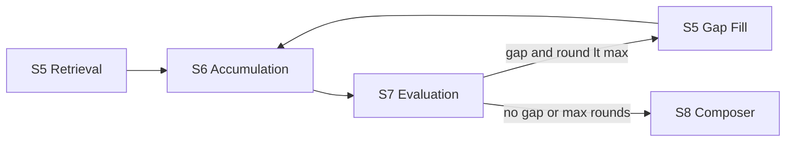

# S5–S7 Evidence Loop

Deterministic evidence evaluation with optional gap-filling back to S5.

## Responsibility boundaries

| Stage | Name | Role |
|-------|------|------|
| S5 | Evidence Planning & Tool Use | Retrieve evidence only; no cross-claim adoption |
| S6 | Evidence Accumulation | Sync tool traces, normalize `state.evidence`, set `evidence_accumulated` |
| S7 | Evidence Evaluation | Deterministic `EvidenceDecisionReport` + optional `EvidenceGapRequest` |
| S5 (gap) | Gap Filling | Narrow whitelist, bounded steps, append-only evidence |
| S8 | Answer Composition | Express answer per `ClaimDecision.adoption` only |

LLM curation in S7 is assist-only: it may refine wording/ranking but must not override deterministic `adoption` or `RejectedEvidence`.

## Flow



State machine helper: `_run_evidence_loop()` in `state_machine.py`.

## Policy tiers

`claim_policy_registry.resolve_policy(claim)`:

1. **Known** — `claim_type` in `CLAIM_POLICIES` (ticket_price, opening_hours, …)
2. **Family** — `claim_family` defaults (ticket_booking, review_experience, …)
3. **Generic** — open claims via `claim_description`; never raises

## Key schemas

### `EvidenceDecisionReport`

- `claim_decisions[]` — per-claim `adoption`, `coverage_quality`, `confidence`, limitations
- `evidence_conflicts[]`, `rejected_evidence[]`
- `evidence_gap_requests[]` — when S7 needs more retrieval
- `overall_confidence`

### `EvidenceGapRequest` / `EvidenceGapLoopState`

- `gap_signature` = `{claim_type}|{claim_family}|{missing_evidence_need}|{sorted suggested_tools}`
- `max_gap_rounds` default **1** (`evidence_max_gap_rounds`)
- `evidence_gap_max_extra_steps` default **3** per gap request

### `TravelAgentState` fields

- `evidence_decision_report`, `gap_loop_state`, `current_evidence_gap_request`
- `pending_evidence_gap_requests`, `evidence_accumulated`

## Gap loop rules

1. S7 emits `evidence_gap_requests` when coverage is insufficient and policy allows fill.
2. State machine selects highest-priority gap not in `failed_gap_ids` / duplicate `gap_signature`.
3. S5 gap mode: only `suggested_tools`, render `query_templates`, tag `ToolTrace.gap_filling`.
4. Re-run S6 → S7 once (default). If no new evidence, gap marked failed.
5. S8 runs only after loop exits.

## S8 adoption expression

| `adoption` | Composer rule |
|------------|-----------------|
| `adopt` | State as supported fact with citations |
| `adopt_with_limitation` | Answer with stated limitations |
| `candidate_only` | Platform/search clues only — not official fact (e.g. 五彩滩 ticket ¥96 候选) |
| `refuse_to_guess` | Explicitly cannot confirm |
| `ask_clarification` | Ask user instead of guessing |
| `omit` | Do not mention claim in body |

## Config (`.env`)

```
EVIDENCE_MAX_GAP_ROUNDS=1
EVIDENCE_GAP_MAX_EXTRA_STEPS=3
```

## Tests

```powershell
cd apps/agent-python
$env:PYTHONPATH = (Get-Location).Path
pytest app/evals/evidence_evaluation_tests.py app/evals/evidence_curation_tests.py -q
```
